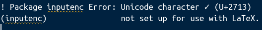
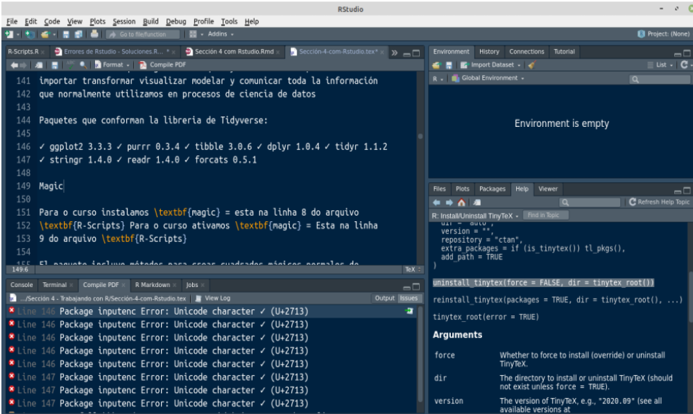
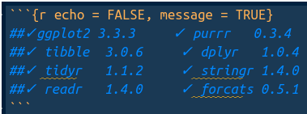
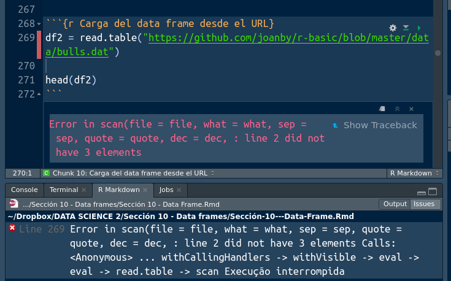

```{r setup, include=FALSE}
knitr::opts_chunk$set(echo = TRUE)
```

# 1 error despues de la instalación - NO GENERA ARCHIVOS PDF 1er PASO INTENTE CON:

#### Información repasada

Problemas con la generación del PDF

Si tienes problemas con la generación del PDF usando un Rmd, lo suyo es que pruebes de ejecutar antes la actualización de MarkDown a la versión compatible con las librerías de R:

    install.packages("devtools")
    library(devtools)
    install_version("rmarkdown",version=1.8)

## Instalando tinytex (antes se debe instalar Miktex)

También es recomendable instalar tinytex una vez instalado la librería de TeX que corresponda para tu sistema operativo si no has instalado anteriormente MikTex como vimos en la sección inicial del curso. Para ello simplemente debes ejecutar la línea

    install.packages("tinytex")

y a continuación invocar la línea

    tinytex::install_tinytex()

Finalmente, algunos alumnos me han reportado que esta solución parece funcionar después de haber hecho todos los pasos anteriores, por si os ocurre:

https://stackoverflow.com/questions/33650869/how-can-i-set-the-latex-path-for-sweave-in-r

Una vez instalado, para comprobar su correcta instalación, ejecutar el siguiente código R:


writeLines(c(
  '\\documentclass{article}',
  '\\begin{document}', 'Hello world!', '\\end{document}'
), 'test.tex')
tinytex::pdflatex('test.tex')


=====================================================================================================

#### Ahora al intentar usar el comando:

    install.packages("devtools")
    ou
    install.packages('devtools', dependecies=TRUE)
    
# Aparece el siguiente error:

*ERROR: dependencies ‘usethis’, ‘covr’, ‘httr’, ‘roxygen2’, ‘rversions’ are not available for package ‘devtools’* - 

# Ese fue el primer error que aparecio

* removing ‘/home/arturo/R/x86_64-pc-linux-gnu-library/4.0/devtools’
Warning in install.packages :
  installation of package ‘devtools’ had non-zero exit status

 The downloaded source packages are in
	‘/tmp/Rtmp3ejLTb/downloaded_packages’

#### Solución:

##### 1er Intento:

En el terminal sea del linux o del Rstudio usar el comando:

    sudo apt install build-essential libcurl4-gnutls-dev libxml2-dev libssl-dev
### Despues de hacer el comando consegui seguir con los paso de la 1ra instrucción del curso

## No abre automaticamente el PDF. Solución aun no definida.

# Error para iniciar el PDF

===============================================================================




Try other LaTeX engines instead (e.g., xelatex) if you are using pdflatex. See https://bookdown.org/yihui/rmarkdown-cookbook/latex-unicode.html
Erro: LaTeX failed to compile Sección-4-com-Rstudio.tex. See https://yihui.org/tinytex/r/#debugging for debugging tips. See Sección-4-com-Rstudio.log for more info.
Além disso: Warning message:
In has_crop_tools() : 
Tool(s) not installed or not in PATH: pdfcrop
-> As a result, figure cropping will be disabled.
Execução interrompida
===============================================================================
    
## 1er intento 
instale el latexpdf *(sin exito, no funciono)* 

## 2do intento
intente instalar el **crop tools()** *(sin exito, no funciono)*  

    sudo apt install python3-poppler-qt5 python3-pypdf2 python3-pip
    pip3 install https://github.com/arminstraub/krop/archive/v0.6.0.tar.gz --user

## 3er intento. 
instalando latex solo *(sin exito, no funciono)*

    sudo apt-get install texlive-full

Actualizo la version

    sudo tlmgr update --self
    
## 4to intento. 
Librerias activadas *(sin exito, no funciono)*
> library(utf8)
> library(rmarkdown)
> library(tidyverse)    
> library(latexpdf)
> library(devtools)
> library(knitr)

## 5to intento.

A - desinstalo tinytex y comienzo con miktex*(sin exito, no funciono)*

## Instalando miktex

###### a. Register GPG key
sudo apt-key adv --keyserver hkp://keyserver.ubuntu.com:80 --recv-keys D6BC243565B2087BC3F897C9277A7293F59E4889

###### b. Register installation source

*Linux Mint 20:*
echo "deb http://miktex.org/download/ubuntu focal universe" | sudo tee /etc/apt/sources.list.d/miktex.list

###### c. Install MiKTeX
sudo apt-get update
sudo apt-get install miktex

## 6to intento.

Abri el Archivo **Tex** 
En la parte que dice **Compile PDF**  clique. Ahi determine que en la linea 146 hay un problema. Sigue:



Me dirigi a essa linea y vi que tiene unos archivos con check list, vi que eran unos archivos que no pueden estar en el Markdown porque causa problemas con la copilación del PDF que asi la solución fue Ponerlos como imagen usando el siguiente codigo: $ ! [] () $


# Error alignment cuando estas con tablas
En el codigo abajo aparece el siguiente error:

*! Extra alignment tab has been changed to $\setminus cr$*.

```{r}
#$$|x| = 
#\left\{\begin{array}{l}
#                        -x & \text{si }x\le 0
#                        \\
#                        +x & \text{si }x\ge 0
#\end{array}\right.$$
```

Para solucionar esse error es importante saber lo siguiente:
* *(l)* Todo aliniado a la izquierda
* *(lr)* Uno aliniado a la izquierda y otro a la derecha
* *(rr)* para que las dos queden aliniadas a la derecha
* *(cr)* Para aliniarlo en el centro - Por defecto el error dice que usar ese para aliniarlo en el centro y evitar ese error.

En este caso esta desfasao que asi para solucionarlo puedes usar el lr ou rr ou cr ejemplo:

$$|x| = 
\left\{\begin{array}{rr}
                        -x & \text{si }x\le 0
                        \\
                        x & \text{si }x\ge 0
\end{array}\right.$$

# Error al llamar una variable desde la URL
# Al cargar un data set
Como no fue posible usar el read.table para llamarlo tuve que buscar otra opción para poder llamar esa información desde la web



###### Para solucionar ese error:

```{r Carga del data frame desde el URL}
# df2 = read.table("https://github.com/joanby/r-basic/blob/master/data/bulls.dat") NO FUNCIONA - Si alguien sabe como puedo hacer por favor me orientar - arturocastro47@gmail.com

#Instalo la libreria RCurl la llama y sigo las funciones:
library(RCurl)
dfURL <- getURL("https://raw.githubusercontent.com/joanby/r-basic/master/data/bulls.dat", ssl.verifypeer = FALSE)

df <- read.csv(textConnection(dfURL), 
      sep = "") #Indica las separaciones de una columna con otra en el fichero, da error si el separador fue introducido equivocadamente
     

str(df) #Resumen de lo que tiene el data frame
head(df) #5 primeras filas del data frame
tail(df) #5 Ultimas filas del data frame
```

# ERROR 

**Attaching package: ‘dbplyr’ The following objects are masked from ‘package:dplyr’: ident, sql**

Para solucionar ese error basta con colocar lo siguiente:

`library(dbplyr, warn.conflicts = FALSE)`

No volvera aparecer mas. 
Esa información fue obtenida de: 

https://stackoverflow.com/questions/39137110/what-does-the-following-object-is-masked-from-packagexxx-mean

## Error al instalar la libreraria KableExtra error con una dependencia svglite

###### Solución 1 
Intente usar con el install packages con dependencies = True
No funciono.

###### Solución 2
Intente instalar el paquete svglite y da error ERROR: dependency ‘systemfonts’

###### Solución 3
Intente instalar el systemfonts y dio un error de configuración
ERROR: configuration failed for package ‘systemfonts’

**Verifique lo que dice el error**
--------------------------- [ANTICONF] --------------------------------
Configuration failed to find the fontconfig freetype2 library. Try installing:
 * deb: libfontconfig1-dev (Debian, Ubuntu, etc)
 * rpm: fontconfig-devel (Fedora, EPEL)
 * csw: fontconfig_dev (Solaris)
 * brew: freetype (OSX)
If fontconfig freetype2 is already installed, check that 'pkg-config' is in your
PATH and PKG_CONFIG_PATH contains a fontconfig freetype2.pc file. If pkg-config
is unavailable you can set INCLUDE_DIR and LIB_DIR manually via:
R CMD INSTALL --configure-vars='INCLUDE_DIR=... LIB_DIR=...'


#### SOLUCION FINAL: 
* sudo apt-get install -y libfontconfig1-dev
* PASO 1 instalo eso para configurar

sudo apt install apt-file

* Uso el siguiente comando:
apt-file search fontconfig.pc

* Si aparece que ya esta instalado uso el siguiente comando:
export PKG_CONFIG_PATH=/usr/lib/x86_64-linux-gnu/pkgconfig

* finaliza con el install.packages("systemfonts")

* **Como esta vez no dio error instala la libreria kableExtra**

