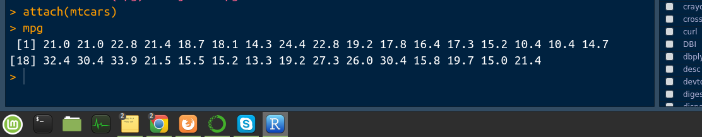

# Organización de datos se clasifica.

Se clasifica en 3
* Datos no estructurados
  - txt, csv
* Datos semi-estucturados
  - xml, json
* Datos estucturados
  - mysql, orc, parquet etc.

# Data Frame:

Un data frame es una tabla de doble entrada, formada por variables en las columnas y observaciones de estas variables en las filas, de manera que cada fila contine los valores de las variables para un mismo caso o un mismo individuo.

Los tipos de datos que consideramos son los siguientes:
* **Datos de tipo atributos o cualitativos**: Son los que expresan una cualidad del individuo tales como el sexo, el DNI, la especie.... En $R$, guardaremos las listas de datos cualitativos en `vectores` (habitualmente, de palabras), o en factores si vamos a usarlas para clasificar individuos.

* **Datos ordinales**: Son datos similares a los cualitativos, con la unica diferencia de que se pueden ordenar de manera natural. Por ejemplo, 
    - Los niveles de calidad ambiental de un ecosistema (malo, regular, normal, bueno, muy bueno)
    - Calificaciones en un examen (suspenso, aprobado, notable, sobresaliente)

Son datos ordinales. En cambio no se pueden ordenar de manera significativa a los sexos o a las especies de individuos. en $R$, guardaremos las liastas de datos ordinales en factores ordenados.

* **Datos cuantitativos**: Son datos que se refieren a medidas:
    - Edades
    - Longitudes
    - Pesos
    - Tiempos
    - Numeros de individuos.. etc...
En $R$, guardaremos las liastas de datos cuantitativos en vectores de numeros.

###### Qué son los factores?
Los factores son una estructura de datos para manejar variables categóricas. A ver Rafa, explica eso otra vez!

###### Qué es una variable categórica?
Las variables categóricas son datos que toman una cantidad finita de valores. Es decir, que pueden pertenecer a una de varias clases o categorías.

Ejemplos pueden ser rangos de edades, colores, o días de la semana

En análisis de datos y estadística las variables categóricas se tratan de manera diferente a las variables continuas o numéricas, como lo que vimos en la entrada sobre variables en R.

Necesitamos tener un objeto en R para eso. Los factores permiten trabajar con modelos y gráficas de variables categóricas. Por eso son importantes.

###### Ejemplos con Factores en R
Para los datos de esta práctica vamos a imaginar una tienda de ropa camisetas/playeras/franelas/remeras… (qué difícil es hablar el español)

Luego supongamos que te interesa saber cuánta ropa tienes por tallas o medida. Para eso, decides hacer un registro de la talla de cada camiseta: pequeña con S, mediana con M, y grande con G.

Haces un vector en R que contenga la talla de cada camiseta. Luego piensas hacer una gráfica con el conteo por talla… Todo parece tener sentido no?

En R, tenemos el código con el vector de tallas y ejecutamos. La función plot es para graficar.

```{r Ejemplo 1 factores en R}
tallas = c('m', 'M', 's', 's', 'g', 'g', 'g')
# Al intenta graficar tallas con plot(tallas) va a dar un error por lo que debemos convertirlo en un factor 

factortallas = factor(tallas)
plot(factortallas)

# Puedo determinar los lvls que tiene el factor
levels(factortallas)
```

* **data()**: Para abrir una ventana con la lista de los objetos de datos a los que tenemos acceso en la sesión actual de R (los que lleva la instalación básica de R y los que aportan los paquetes que tengamos cargados.)
  - Si entramos `data(package = .packages(all.available = True))` 
    obtendremos la lista de todos los objetos de datos a los que 
    tenemos acceso, incluyendo los de los paquetes que tengamos 
    instalados, peo que no esten cargados en la sesión actual.
    
Si escribo `data()` En la consola de R aparecerera todas las series de R data sets para usar.
Recordar que si escribes en la consola `ls()` Apareceran todas las variables guardadas en `environment`

Para eliminar todas las variables que estan en `environment`  escribir `rm(list=ls())` 

## Para obtener información del data frame

Para usar el data sets y controlar el flujo de información tenemos que usar:

* **head(d.f, n)**: Para mostrar las `n` primeras filas del data frame. `Por defecto se muestran las 6 primeras filas`.
* **tail(d.f, n)**: Para mostrar las `n` últimas filas del data frame. Por defecto se muestran las ultimas 6.
* **str(d.f)**: Para conocer la structura global de un data frame.
* **names(d.f)**: Para producir un vector con los nombres de las columnas

# Data frame de Iris
```{r Ejemplo 1 Flor iris obteniendo información de un data frame}
df = iris
head(df, 5) #Primeras 5 filas
tail(df, 5) #Ultimas 5 filas
names(df) #Para saber los nombres de los parametros
str(df) #Para ver como esta estructurado 
```

## Obteniendo información del data frame

* **rownames(d.f)**: Para producir un vector con los identificadores de las filas
    - R entiende siempre que estos identificadores son palabras, aunque sean números, de ahí que los imprima entre comillas.
* **colnames(d.f)**: Para producir un vector con los identificadores de las columnas
* **dimnames(d.f)**: Para producir una lista formada por dos vectores (el de los identificadores de las filas y el de los nombres de las columnas)
* **nrow(d.f)**: Para consultar el número de filas de una data frame
* **ncol(d.f)**: Para consultar el numero de columnas de un data frame
* **dim(d.f)** Para producir un vector con el numero de filas y el de columnas.
* **d.f$nombre_variable**: Para obtener una columna concreta de un data frame
    * El resultado sera un vector o un factor, segun como este definida la columna 
      dentro del data frame.
    * Las variables de un data frame son internas, no estan definidas en el entorno 
      global de trabajo de R.

```{r Ejemplo 2 df Orange Obteniendo información del data frame}
df= Orange #La cargo en el entorno con alt + Enter asi puedo llamarla para cuando la necesite. 

str(Orange) #Ver estructura del df
head(Orange, 4) #Primeras 4 variables
tail(Orange, 4) #Ultimas 4 variables
names(Orange) #colnames o names es la misma cosa
rownames(Orange) #Nombre de las filas - aparece entre comillas deven considerarse como palabras
dimnames(Orange) #Muestra que es una lista con 2 posiciónes, la primera fila da el nombre de las filas y el segunda da el nombre de las columnas

dim(Orange) #Resultado es un vector con el # de filas y # de columnas en otro en este caso es 35 filas y 3 columnas

#Como en la linea 64 cargue la información de arboles ahora la puedo llamar con df$ y tabulador
df$age[1:5]  #Resultado un vector desde el 1 hasta el 5
df$Tree[1:5] #Adiciona la palabra Levels lo cual indica que es un factor, No aparece solo los valores si no tambien los niveles
```

## Sub-data frames

* **d.f[n, m]**: Para extraer "trozos" del data frame por filas y columnas(funciona exactamente igual que en matrices) donde `n` y `m` pueden definirse como:
  - Intervalos
  - Condiciones
  - Números naturales
  - No poner nada
  - Si solo queremos definir la subtabla quedandonos con algunas variables, basta 
    aplicar el nombre del data frame al vecto de variables.
  - Estas construcciones se pueden usar tambien para reordenar las filas o columnas.
  
```{r Ejemplo 3 Acceso al DF en trozos especificos}
df = iris
df[1:10, ] #Fila de la 1 hasta la 10 y todas las columnas (Aparecen todas las columnas por no tener información en el otro eje)

df[1:10, 2:4] #Fila de la 1 hasta la 10 y de columnas de la 2 hasta la 4 

#Aqui obtengo de la especie de iris (setosa) Todos los tipos de sepalos (sepal widht) mayor a 4
df[df$Species == "setosa" & df$Sepal.Width>4, ] #Nivel del factor setosa, y anchura de cepalos de 4 da el valor asi cumple la condicion booleana de lo que necesito

#Para filtrar mas la parte que quiero puedo especificar filas y columnas sigue:
df[df$Species == "setosa" & df$Sepal.Width>4, ][c(1,3), #Fila 1y3
                                                c(2,5)] #Comluna 2y5
```

```{r Ejemplo 4 extrayendo datos de data frame}
# Extrayendo informaciones
dataOrange = Orange #Hago una copia y saco las partes que quiero ejempĺo:
dataOrange[c(10:12), ] #Da las filas de 10 hasta 12 y muestra todas las columnas

#Especificando posiciones para extraer datos del data frame
dataOrange[c(2,17), #Fila 2 y 17
           c(1,3)]  #Columnas 1 y 3

dataOrange[2,3] #Extraigo la información de la fila 2 y columna 3

#Haciendo filtro booleano
dataOrange[dataOrange$circumference<= 50, ] #Todos los valores de filas de cicumference <= 50 y mostrando todas las columnas
```

###### Leyendo tablas de datos

Para crear un data frame a partir de un fichero de texto simple que contenga una tabla de datos, podemos aplicar la función al nombre del fichero, si esta en el directorio de trabajo de $R$, o a su `URL`, si esta en internet< en ambos casos, entre comillas. Esta función `read.table()` tiene algunos parametros que evitan errores en la creación del data frame.

* **read.table()**: Para definir un data frame a partir de una tabla de datos contenida en un fichero.
  - Este Fichero puede estar guardado en nuestro ordenador o bien podemos conocer su url. Sea cual sea el caso, se aplica la función al nombre del fichero o a la dirección entre comillas.

Enlace para practicar el la extracción de datos de data frame: 

  - https://archive.ics.uci.edu/ml/datasets.php
  - https://online.stat.psu.edu/stat501/node/1025
  - https://people.sc.fsu.edu/~jburkardt/data/csv/csv.html

```{r Llamando el data set desde el ordenador con read table}
# Tengo que tener el archivo en txt guardado en el ordenador
df1 = read.table("Data Sets/vowel.txt")

# Una vez importado el archivo hay que conferir que que se ha importado bien lo cual para verla usamos el str y view o head
head(df1)
str(df1)
#En el resultado observamos que no hay nada especificado ni en columnas ni en filas y tampoco en variables globales pero observamos que tiene factores levels y separaciones por comas por lo que es bueno agregar , sep = ',' para las separaciones y para el titulo header = 'true'

```


#### Parametros de read.table()

Parametros que evitan errores en la creación del data frame.
* **header = TRUE**: Para indicar si la tabla que importamos tiene una primera fila con los nombres de las columnas. El valor por defecto es FALSE.
* **col.names = c(...)**: Para especificar el nombre de las columnas. No olvidar que cada nombre debe ir entre comillas.

* **sep**: Para especificar las separaciones entre columnas en el fichero (si no es un espacio en blanco). Si es asi, hay que introducir el parametro pertinente entre comillas. 
Ejm.

Tenemos que especificar 
* `$sep = ","$` para indicar que las separaciones entre columnas son comas, 
* `$sep= ";"$` para indicar que las separaciones entre columnas son signos de punto y coma 
* `$sep = "\t"$` para indicar que las separaciones entre columnas son tabuladores.
           
* **dec**: Para especificar el signo que separa la parte entera de la decimal (si no es un punto.), Si es asi, hay que introducir el parametro pertinente entre comillas.

```{r mejorando el data frame con sep y header}
df1 = read.table("Data Sets/vowel.txt", header = TRUE, sep= ',')
#Agregando el header = true y sep = ',' ya construye nuestra matriz.

head(df1)
str(df1)
```
Fichero **Data on Bulls** de la pagina anterior nombrada.:

Breed (1/5/8), 
Sale Price, 
Yearling height at shoulder (in.), 
Fat Free Body (lbs.), 
Percent Fat-free body, 
Frame -- scale from 1 (small) to 8 (large),
Back fat (in.), 
sale height at shoulder (in.) 
and sale weight (lbs.) of three breeds of bulls.


```{r Carga de ficheros local}
df = read.table("Data Sets/bulls.dat", #Llamo el archivo desde el ordenador
                header = FALSE, #Para eliminar los nombres de la                                    cabecera
                #Nuevos nombre de la cabecera
                col.names = c("breed", 'sale_price', 'shoulder',  
                          'fat_free', 'percent_ff', 'frame_scale',
                          'back_fat', 'sale_height','sale_weight'),
                sep = "", #Indica las separaciones de una columna con otra en el fichero, da error si el separador fue introducido equivocadamente
                dec = ".") #Puedo quitar el separador decimal
                
head(df)  
str(df)
```

#### Carga desde URL

* Para importar un fichero de una página web segura (cuyo url empiece con https), no podemos entrar directamente la dirección en read.table(); una solución es intalar y cargar el paquete `RCurl` y entonces usar la instrucción **read.table(texConnection(getURL("url")),...)**.

```{r Carga del data frame desde el URL}
# df2 = read.table("https://github.com/joanby/r-basic/blob/master/data/bulls.dat") NO FUNCIONA - Si alguien sabe porque no puedo generarl el data frame con ese codigo por favor me orientar - arturocastro47@gmail.com

library(RCurl)
dfURL <- getURL("https://raw.githubusercontent.com/joanby/r-basic/master/data/bulls.dat", ssl.verifypeer = FALSE)

df <- read.csv(textConnection(dfURL), 
      header = FALSE, #Para eliminar los nombres de la                                    cabecera
      #Nuevos nombre de la cabecera
      col.names = c("breed", 'sale_price','shoulder',
                    'fat_free', 'percent_ff', 'frame_scale',
                    'back_fat', 'sale_height','sale_weight'),
      sep = "", #Indica las separaciones de una columna con otra en el fichero, da error si el separador fue introducido equivocadamente
      dec = ".") #Puedo quitar el separador decimal

str(df)
head(df)
tail(df)
```
        
###### Más parametros de read.table()

* **stringsAsFactors**: Convierte la información de un data frame de factores para caracteres *SOLO LAS LETRAS*.

Por defecto, `read.table()` transforma en factores las columnas de palabras de la tabla que importa. 

* **Para prohibir la transformación** de las columnas de palabras en factores debemos usar **stringsAsFactors=FALSE**  (ya que por defecto, R realiza dicha transformación)

* **encoding**: Este parametro sirve para indicar la codificación de alfabeto del fichero que se va a importar, y se ha de usar si dicho fichero contiene palabras con letras acentuadas o caracteres especiales y su codificación no coincide con la que espera nuestro ordenador.

**En mi caso el Rstudio que tengo lee todo lo que tiene en el data frame y lo convierte al tipo de archivo que es. no aparece el factor por defecto a menos que quiera hacer el string as factor = True**

```{r Ejemplo 1 del strigns as factors}
# Aqui no funciona porque el data frame es solo de numeros por lo que no considera el codigo de strings as factors ni como verdadero ni como falso. solo da el valor de la cadena como int
df3 <- getURL('https://raw.githubusercontent.com/argeus47/r-basic/master/data/olive.txt')
results3 <- read.table(textConnection(df3), 
                      stringsAsFactors = T) 
                        
str(results3)
```


```{r Ejemplo 2 uso del stringsasfactors}

library(RCurl)
df <- getURL('http://winterolympicsmedals.com/medals.csv')

df1 <- read.csv(textConnection(df), 
                      stringsAsFactors=T, #Convierto los caracteres que esta por defecto en factores 
                       header = TRUE) 
str(df1)
```


#### Leyendo diferentes tipos de fichero

* **read.csv()**: Para importar ficheros en formato CSV
* **read.xls() o read.xlsx()**: Para importar hojas de calculo tipo excel u OpenOffice en formato XLS o XLSX, respectivamente. Senecesita el paquete xlsx
* **read.mtb()**: Para importar tablas de datos Minitab. Se necesita el paquete foreign
* **read.spss()**: Para importar tablas de datos SPSS. Se necesita el paquete foreign
**NOTA**: Los archivos xls o xlsx es mejor trabajarlos en CSV.

#### Exportando datos a ficheros

* **write.table(df, file="")**: Para exportar un data frame a un fichero
  - **file = ""**: Es donde indicaremos el nombre que queremos darle al fichero
  - Podemos usar el parametro `sep` para indicar el simbolo de separación de columnas. 
    Siempre entre comillas
  - Tambien podemos utilizar el parametro `dec` para indicar la separación entre la 
    parte entera y decimal de los datos.

###### Guardar un data frame

Baje la información de la pagina web en un archivo txt

```{r Ejemplo 3 guardar un data frame}
write.table(results3, file = "Data Sets/BajandodelaWEBOlive.txt")
#Aqui tomo la información del ejemplo 1 que es leer la información de internet y bajo el archivo para mi computador con nombre de BajandoleWEBOlive
df4 = read.table("Data Sets/BajandodelaWEBOlive.txt", 
                 header = TRUE, 
                 dec = ".")#lLamo el data set que baje en mi ordenador.
head(df4)
```

## Construyendo data frames

* **data.fame(vector_1,...,vector_n)**: Para construir un data frame a partir de vectores introducidos en el orden que queremos disponer las columnas de la tabla.
  - `R` considera del mismo tipo de datos todas las entradas de una columna de un data fame.
  - Las variables tomarán los nombres de los vectores. Estos nombres se pueden especificar en el argumento de `data.frame` entrando una construcción de la forma 
    `nombre_variable = vector`.
  - **rownames**: Para especificarlos identificadores de las filas
  - Tambien en esta función podemos hacer uso del parametro **stringsAsFactors** para evitar la transformación de las columnas de tipo palabra en factores
* **fix(d.f)**: Para crear / editar un data frame con el editor de datos
* **names(d.f)**: Para cambiar los nombres de las variables
* **rownames(d.f)**: Para modificar los indicadores de las filas. Han de ser todos diferentes
* **dimnames(d.f)=list(vec_nomfil, vec_nom_col)**: Para modificar el nombre de las filas y de las columnas  
* **d.f[num_fila,] = c(...)**: Para añadir una fila a un data frame.
    - Las filas que añadimos de esta manera son vectores, y po rtanto sus entradas han de ser todas del mismo tipo.
    - Si no añadimos las filas inmediatamente siguiendo la ultima fila del data frame, los valores entre su ultima fila y las que añadimos quedaran no definidos y aparecera `NA`.
    - Para evitar el problema anterior, vale usar la función `rbind()` para concatenar el data frame con la nueva fila

```{r Ejemplo 4 Construyendo data frames}
#Creo 3 vectores cada uno con 10 digitos
Algebra = c(1,2,0,5,4,6,7,5,5,8)
Analisys = c(3,3,2,7,9,5,6,8,5,6)
Statistics = c(4,5,4,8,8,9,6,7,9,10)

#Generando el data frame
grades = data.frame(Alg=Algebra, An =Analisys, Stat=Statistics)
str(grades)#Viendo las caracteristicas del data frame

#Agrego 1 asignatura mas calculo
Calculus = c(5,4,6,2,1,0,7,8,9,6)
grades2 = cbind(grades, Calculus)
head(grades2)
```
  
```{r Ejemplo 5 creación de data frame y llamando las informaciones}
gender = c('H', 'M', 'M', 'H')
age =    c(23,   45,  20,  30)
family = c(2,    3 ,   4,  2)
df5 = data.frame(genero = gender, edad = age, familia = family)

row.names(df5) = c('P1', 'P2', 'P3', 'P4') #Cambie los valos de 1, 2, 3 por p1,p2..p4
df5

#Creo una nueva lista Alterando los nombres iniciales es decir
#Con dimnames puedo cambiar el nombre de las filas y las columnas a la vez.
dimnames(df5) = list(
  c('Antonio', 'Ricardo', 'Arturo', 'Maria'), #vector 1 = los nombres de p1,p2,p3... los cambio por los nombres abajo:
  c('Sexo', 'Años', 'mienbrosFamilia') # vector 2 = Los nombres de gender, age, family los cambie por los valores actuales que estan en ese vector.
                    )
df5

# Creando una nueva fila
#Con rbind anexo una ultima fila con las siguientes informaciones:
df5 = rbind(df5, c('H', #Sexo
                   30, #Edad
                   1)) #Mienbros de la familia
df5

#Cambio ahora el vector sexo para caracter(recordando que caracter es texto str)
df5$Sexo = as.character(df5$Sexo)  

#agrego una ultima columna de ingresos
df5$Ingresos = c(10000, 12000, 15000, 12000, 15000) #Recuerda que se le agrego una 5ta columna por eso deben ser 5 valores si no da error.
df5
str(df5)
```
  

## Cambiando los tipos de datos

* **as.character**: Para transformar todos los datos de un objeto en palabras (str)
* **as.integer**: Para transformar todos los datos de un objeto a numeros enteros (int)
* **as.numeric**: Para transformar todos los datos de un objeto a numeros reales (float)


## Mas sobre sub-data frames

* **droplevels(d.f)**: Para borrar los niveles sobrantes de todos los factores, ya que las columnas que son factores heredan en los sub-data frames todos los niveles del factor original, aunque no aparezcan en el trozo que hemos extraido.
* **select(d.f, parametros)**: Para especificar que queremos extraer de un data frame.
    - **starts_with('x')**: Extrae del data frame las variables cuyo nombre empieza conla palabra 'x'
    - **ends_with('x')**: Extrae del data frame las variables cuyo nombre termina con la palabra 'x'
    - **contains('x')**: Extrae del data frame las variables cuyo nombre contiene la palabra 'x'
      - Se necesita el paquete `dplyr` o mejor aún `tidyverse`
* **subset(d.f, condición, select = columnas)**: Para extraer del data frame las filas que cumplen la condición y las columnas especificadas.
  - Si queremos todas las filas, no hay que especificar ninguna condición.
  - Si queremos todas las columnas no hay especificar el parametro `select`.
  - Las variables en la condición se especifican con su nombre, sin añadir antes el 
    nombre del data frame.
  
  
```{r Ejemplo 06 Filtrando información y haciendo subsets}
#Creo los vectores para inserir en el data frame
gender = c('H', 'M', 'M', 'H')
age =    c(23,   45,  20,  30)
family = c(2,    3 ,   4,  2)
#Creando un data frame nuevo
df5 = data.frame(genero = gender, edad = age, familia = family, stringsAsFactors = TRUE)
# En este caso solo extraigo la cantidad de personas que son mujer pero va a mostrar los levels que tiene hombre y mujer

df5_mujer = df5[df5$genero =='M', ]
str(df5_mujer)

#Puedo redefinir la tabla con froplevels para solo tener 1 solo factor o level en este caso la mujer
df5_mujer = droplevels(df5_mujer)
str(df5_mujer)
```

## Tidyverse

```{r Tidyverse Para buscar información en tablas}
library(tidyverse)
library(dbplyr, warn.conflicts = FALSE)
#Para buscar una palabra que desee en una tabla en este caso es Petal, arroja como relaciona todo referente a eso
iris_petal = select(iris, #Data frame iris
                    starts_with('Petal')) #Columnas que acaban en                                              petal
head(iris_petal)

#Para buscar una palabra que desee en una tabla en este caso es Length, arroja como relaciona todo referente a eso
iris_length = select(iris, #Data frame iris
                     ends_with('Length')) #Columnas que acaban en                                              length
head(iris_length)
```


## Subset

```{r Subset ejemplo 1 Para buscar información en tablas}

# Buscar las primeras 5 setosas de la flor iris
setosa = subset(iris, #Data frame de iris
                Species == 'setosa', #De las especies solo escogo                                        la setosa
                selec = c(1,3)) #selecciono la columna 1 y 3 del                                     data frame
head(setosa, 5) #Saco las primeras 5 para ver los valores
str(setosa)
```

```{r Subset ejemplo 2}

# Buscar las primeras 5 setosas de la flor iris
versicolor = subset(iris, #Data frame iris
                    Species == 'versicolor', #Toda la información de las especies versicolor en el data frame
                    selec = c(1,3)) #Escogo la columna 1 y 3

# Para cambiar la numeración de la posición 51,52 para 1,2...
rownames(versicolor) = 1:nrow(versicolor)

head(versicolor, 5)
str(versicolor)
```
  
  
## Aplicando funciones a data frame

* **sapply(d.f, función)**: Para aplicar una función a todas las columnas de un data frame en un solo paso.
    - **na.rm=TRUE**: Para evitar que el valor devuelva la función para las columnas que mantengan aun NA sea NA
* **aggregate(variables~factors, data = d.f, FUN = función)**: Para aplicar una función variables de un data frame clasificadas pr los niveles de un, o más de un, factor:
    - Si queremos aplicar la función a más de una variable, tenemos que agruparlas con un `cbind`
    - Si queremos separar las variables mediante más de un factor, tenemos que agruparlos con signos `+`
  
```{r Función Sapply}
str(iris)
#Determine la mediana donde va la función ppuedo aplicar la mediana, suma, resta y asi sucesivamente la función que yo desee
sapply(subset(iris, #Llamo el data frame
              select = 1:4), #Selecciono las columnas de la 1 hasta                               la 4
              mean) #Calculo la media

#Aplicando la función Sapply
sapply(iris[ , #Como esta en blanco siginifica que escogi todas las                 filas 
             1:4], #Escogo las columnas de la 1 hasta la 4
       sum) #Sumo todo - Da como resultado el total de cada columna

#Usando la función 
f = function(x){sqrt(sum(x^2))} 

sapply(iris[, #Escogo todas las filas
            1:4], #Escogo las columnas de la 1 hasta la 4
       f) #Aplico la función ya formulada antes
#Cada valor de iris que esta en la función sapply se denomina como x para la función
```

  
```{r Función NARM Para elminar los NA}
#Creo 1 data frame con 2 vectores teniendo NA
df = data.frame(c1 = c(1,2,NA,4), 
                C2 = c(5,NA,2,3))

sapply(df, mean) #Al aplicar el sapply da valor de NA

#Para tener los valores y excluir el NA hago na.rm = T
sapply(df, #llamo el data frame
       mean, #Calculo la media
       na.rm = TRUE) #Excluyo el NA del data frame
```


```{r Ejemplo de la función AGGREGATE factores cbind}
#Por ejemplo si quiero la media por longitud de sepalos y petalos por cada especie de flor sea setosa, versicolor ou virginica
aggregate(cbind(Sepal.Length, Petal.Length)~Species, #Las agrupo con cbind
          data = iris, #Llamo el data frame
          FUN = mean, #Determino la función a realizar en este caso es la media
          na.rm = TRUE) #Elimino los NA 
```
  

```{r transformando a factores variables del data frame mtcars y uso de la función aggregate con diferentes categorias}

head(mtcars)
str(mtcars)

# converti los numeros a factores
mtcars$cyl = as.factor(mtcars$cyl)
mtcars$gear = as.factor(mtcars$gear)
mtcars$carb = as.factor(mtcars$carb)
str(mtcars)

#Agregado con diferentes categorias
#Los numeros van antes de la tilde (~) es decir, los factores - despues de la tilde va lo que quiero saber o determinar
aggregate(mpg~cyl+gear+carb, #Llamo mpg en función de la cilindrada(cyl) + marcha(gear) + carbon (carb)
          data = mtcars, #llamo el data frame
          FUN = mean, #Calculo la media
          na.rn = TRUE)
```

## Variables globales

* **attach(d.f)**: Para hacer un R entienda sus variables como globales y que las podamos usar por su nombre, sin necesidad de añadir delante el nombre del data frame y el simbolo $
  - Si ya hubiera existido una variable definida con el mismo nombre que una variable del data frame al que aplicamos `attach`, hubieramos obtenido un mensaje de error al ejecutar esta función y no se hubiera reescrito la variable global origial.
  
Cuando haces en la consola `attach(d.f)` lo guarda como una variable y esa variable puede ser llamada despues solo por el nombre. Ejemplo: 

Imagen: 


* **detach(d.f)**: Para devolver la situación original, eliminando del entorno global las variables del data frame. (Lo contrario de attach)


