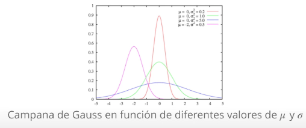
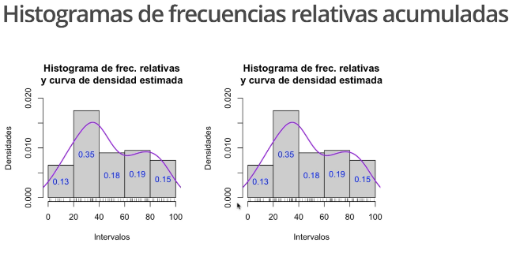

```{r setup, include=FALSE}
knitr::opts_chunk$set(echo = TRUE)
```

# Análisis de datos cuantitativos agrupados

Aunque no seamos completamente conscientes de ello, tendemos a agrupar datos cuantitativos constantemente.

Sin ir más lejos, calificamos de excelente a toda las notas que están sobre el 9. También decimos que una persona tiene 20 años cuando se encuentra en el intervalo $[20,21)$. Es decir, cuando ha cumplido los 20 pero aún no tiene los 21.

En estadística, existen innumerables motivos por los cuales nos interesa agrupar los datos cuando estos son cuantitativos. Uno de estos motivos puede ser perfectamente que los datos sean muy heterogéneos. En este caso, nos encontraríamos con que las frecuencias de los valores individuales serían todas muy similares, lo que daría lugar a un diagrama de barras muy difícil de interpretar, tal y como mostramos en el siguiente ejemplo.

#### Ejemplo 1

Consideremos la siguiente muestra de 24 pesos de estudiantes:
$$weight = c(55.2,54.0,55.2,53.7,60.2,54.6,55.1,51.2,53.2,54.8,52.3,56.9,57.0,55.0,53.5,50.9,55.1,53.6,61.2,59.5,50.3,52.7,60.0)$$
El diagrama de barras de sus frecuencias absolutas, tomando como posibles niveles todos los pesos entre su mínimo y máximo se muestra en la siguiente diapositiva.

Como vemos, todas estas frecuencias se encuentran entre 0 y 2, cosa que no nos da mucha información.

```{r Ejemplo 1}

weight = c(55.2,54.0,55.2,53.7,60.2,54.6,55.1,51.2,53.2,54.8,52.3,56.9,57.0,55.0,53.5,50.9,55.1,53.6,61.2,59.5,50.3,52.7,60.0)
barplot(table(weight), cex.names = 0.40)

```

En cambio, si dividiésemos todos estos posibles valores que puede tomar la variable cuantitativa en intervalos y tomásemos como sus frecuencias las de todos los valores que caen en dicho intervalo, la cosa cambia.

En este caso, sería mucho más fácil interpretar los resultados, ya que estos darán mucha más información. Más adelante veremos como crear estos intervalos.

```{r Ejemplo 1 Agrupando valores en intervalos para genera una grafica con menos barras}

weight = c(55.2,54.0,55.2,53.7,60.2,54.6,55.1,51.2,53.2,54.8,52.3,56.9,57.0,55.0,53.5,50.9,55.1,53.6,61.2,59.5,50.3,52.7,60.0)

hist(weight) #Un diagrama de histograma. 

```

Otro de los motivos por el que necesitamos muchas veces agrupar los datos cuantitativos es porque, como ya dijimos en temas anteriores, la precisión infinita no existe. Por tanto, esta imposibilidad de medir de manera exacta muchas de las magnitudes continuas (tiempo, peso, altura...) nos obliga a trabajar con aproximaciones o redondeos de valores reales y que cada uno de estos represente todo un intervalo de posibles valores.

Por lo general, existen 3 situaciones en las cuales conviene sin lugar a dudas agrupar datos cuantitativos en intervalos, también llamados `clases`

* Cuando los datos son continuos, su redondeo ya define un agrupamiento debido a la inexistencia de precisión infinita.

* Cuando los datos son discretos, pero con un número considerablemente grande de posibles valores.

* Cuando tenemos muchísimos datos y estamos interesados en estudiar las frecuencias de sus valores.

## Como agrupar datos

#### Los 4 pasos:

Antes de estudiar unos datos agrupados, hay que obviamente, agruparlos. Este proceso consta de 4 pasos:

1. Decidir el número de intervalos que vamos a utilizar.
2. Decidir la amplitud de estos intervalos.
3. Acumular los extremos de los intervalos.
4. Calcular el valor representativo de cada intervalo, su `marca de clase`

No hay una forma de agrupar datos mejor que otra. Eso sí, cada uno de los diferentes agrupamientos para un conjunto de datos podría sacar a la luz características diferentes del conjunto.

## La función hist()

La función de `R` por excelentecia para estudiar datos agrupados es `hist`. Dicha función implementa los 4 pasos del proceso.

Si le indicamos como argumentos el vector de datos y el número de intervalos que deseamos, o bien el método para determinarlo (cosa que veremos a continuación), la función agrupará los datos en el número de clases que le hemos introducido, más o menos. Eso sí, sin control de ningún tipo  por nuestra parte sobre los intervalos que produce.

Esto puede vernirnos bien en algunos casos, pero no en otros.

## Paso 1 Estableciendo el número de clases

En este tema explicaremos una receta para agrupar datos. Lo dicho, ni mejor ni peor que el resto.

Lo primero es establecer el número `k` de clases en las que vamos a dividir nuestros datos. Podemos decidir en función de nuestros intereses o podemos hacer uso de alguna de las reglas eistentes. Destacaremos las más populares.

Sea `n` el número total de datos de la muestra.

* *Regla de la raíz cuadrada:* $k=\lceil \sqrt{n} \ \rceil$
* *Regla de Sturges:* $k=\lceil 1+\log_2(n) \rceil$
* *Regla de Scoot:* Se determina primero la amplitud teorica, $A_s$ de las clases.

$$A_s=3.5 \ \cdot \ \tilde{s} \ \cdot \ n^{-\frac{1}{2}}$$

donde $\tilde{s}$ es la desviación típica muestral. Luego se toma

$$k=\left\lceil 
\frac{max(x)-min(x)}{A_s}  
\right\rceil$$

* *Regla de Freedman-Doacpmos:* Se determina primero la `amplitud teórica,` $A_{FD}$ de las clases. 

$$A_{FD}=2 \ \cdot \ (Q_{0.75}-Q_{0.25}) \ \cdot \ n^{-\frac{1}{3}}$$

(Donde, recordemos, $Q_{0.75}-Q_{0.25}$, es el rango intercuantílico) y entonces

$$k=\left\lceil 
\frac{max(x)-min(x)}{A_{FD}}  
\right\rceil$$

Si os fijáis, las dos primeras solo dependen de `n`, mientras que las dos últimas también tienen en cuenta, de formas diferentes, la dispersión de los datos. De nuevo, no hay ninguna mejor que las demás. Pero sí puede ocurrir que métodos diferentes den lugar a la observación de características diferentes en los datos.

## Estableciendo el número de clases con R

Las intrucciones para llevar a cabo las 3 últimas relgas con `R` son,

* `nclass.Sturges`
* `nclass.scott`
* `nclass.FD`

Puede ocurrir que las diferentes reglas den valores diferentes, o no.

## Paso 2 Decidiendo la amplitud

Una vez determinado `k` hay que decidir su amplitud.

La forma más fácil y a la que nosotros utilizaremos por defecto es que la amplitud de todos los intervalos sea la misma, A. Esta forma no es la única. 

Para calcular `A` lo que haremos será dividir el rango de los datos entre `k`, el número de clases, y redondearemos por exceso a un valor de la precisión de la medida.

Si se da el improbable caso en que el cociente de exacto, tomaremos como A esse cociente más una unidad de precisión.

## Paso 3 Extremos de los intervalos

Es la hora de calcular los extremos de los intervalos. Nosotros tomaremos estos intervalos siempre cerrados por su izquierda y abiertos por la derecha, debido a que esta es la forma en que `R` los construye y porque es así como se utilizan en teoría de probabilidades al definir la distribución de una variable aleatoria discreta y también en otras muchas situaciones cotidianas.

Utilizaremos la siguiente notación.

$$[L1,l2),[L2,L3),...,[L_k,L_k+1)$$

donde los $L_i$ denotan los extremos de los intervalos. Estos se calculan de la siguiente forma:

$$L_1=min(x) -\frac{1}{2} \ \cdot \ precisión$$

A partir de $L1$, el resto de intervalos se obtiene de forma recursiva:

$$L_2=L_1+A$$
$$L_3=L_2+A$$
$$\vdots$$
$$L_{k+1}=L_k+A$$
Si no sfijamos bien, los extremos forman una progresión aritmética de salto A:
$$L_i=L_1+(i-1)A, \ \ \ \ \ \ \ \ i=2,...,l+1$$
De esta forma garantizamos que los extremos de los intervalos nunca coincidan con valores del conjunto de datos, puesto que tienen una precisión mayor.

## Paso 4 Marca de clase

Solo nos queda determinar la marca de clase, $X_i$, de cada intervalo $[L_i,L_{i+1})$.

Este no es más que un valor del intervalo que utilizaremos para identificar la clase y para calcular algunos estadísticos.

Generalmente,

$$X_i=\frac{L_i+L_{i+1}}{2}$$
es decir, $X_i$, será el punto medio del intervalo, para así garantizar que el error máximo cometido al escribir cualquier elemento del intervalo por medio de su marca de clase sea mínimo o igual a la mitad de la amplitud del respectivo intervalo.

Es secillo concluir que, al tener todos los intervalos amplitud A, la distancia $X_i$ y $X_{i+1}$ también será A. Por consiguiente,

$$X_i=X_1+(i-1)A, \ \ \ \ \ \ i=2,...,k$$
donde,

$$X_1=\frac{L_1+L_2}{2}$$

#### Ejercicio:
Vamos a considerar el conjunto de datos de `datacrab`. Para nuestro estudio, trabajaremos únicamente con la variable `widht`.

Llevaremos a cabo los 4 pasos explicados con anterioridade:
* Calculo del número de intervalos
* Determinación de la amplitud
* Calculo de los extremos
* Marcas de clase.

```{r Ejemplo con data crab}
library(RCurl)
df <- getURL("https://raw.githubusercontent.com/argeus47/r-basic/master/data/datacrab.txt", ssl.verifypeer = FALSE)

crab <- read.csv(textConnection(df), 
     # stringsAsFactors=FALSE,         
      header = T, #Para que los nombres de la                                    cabecera aparescan
      sep = "", #Indica las separaciones de una columna con otra en el fichero, da error si el separador fue introducido equivocadamente
      dec = ".") #Puedo quitar el separador decimal 
crab <- crab[, #Para que aparezcan todas las filas
              -1] #Para eliminar la primera columna que es solo un identificador para cada fila.


# A continuación,  definimos la variable CW que contiene los datos de la variable WIDHT
cw = crab$width #Variable numerica con decimales
```

#### Solución

###### Paso 1
Calculemos el número de clases según las diferentes reglas que hemos visto:

* Metodo 1 Regla de la raiz cuadrada:
```{r Ejemplo con data crab Regla de la raiz cuadrada}
n=length(cw)
k1 = ceiling(sqrt(n)) #Función ceiling cuando el valor es positivivo y tiene decimales redondea hacia arriba
#Si la función es negativa y tiene decimales redondea hacia abajo
k1 #Segun la regla de la raiz cuadrada devemos tomar 14 intervalos
```

* Metodo 2 Regla de Sturges:
```{r Ejemplo con data crab Regla de Sturges}
k2 = ceiling(1+log(n,2))
k2 #Segun la regla de sturges devemos tomar 9 intervalos
```

* Metodo 3 Regla de Scott:
```{r Ejemplo con data crab Regla de Scott}
As= 3.5*sd(cw)*n^(-1/3) #Amplitud teorica
As
k3 = ceiling(diff(range(cw))/As) #Cantidad de intervalos
#Función range = Da el valor menor y el valor mayor de la función
k3 #Segun la regla de Scott devemos tomar 10 intervalos

# Python = np.ptp(cw) = Rstudio = diff(range(cw))
```

* Metodo 4 Regla de Freedman-Diaconis:
```{r Ejemplo con data crab Regla de FreedmanDiaconis}
quantile(cw, 0.75,names = FALSE)
quantile(cw, 0.25,names = FALSE)
Afd= 2*(quantile(cw,
                 0.75,
                 names = FALSE)-
        quantile(cw,
                 0.25,
                 names = FALSE)
        )*n^(-1/3)

k4= ceiling(diff(range(cw))/Afd)
k4 #Segun la regla de Freedman devemos tomar 13 intervalos
```

Podemos comprobar nuestros 3 ultimos resultados con `R`:
```{r Ejemplo con data crab Comprobando resultados de las reglas anteriores}
k2 #Resultado de la regla de Sturges
nclass.Sturges(cw) #Reglad e Sturges
print(' ')
k3 #Resultado de la regla de Scott
nclass.scott(cw) #Regla de Scott
print(' ')
k4 #Resultado de la regla de Freedman
nclass.FD(cw) #Regla de freedman

#Es posible que tenga una pequeña variación en el resultado de calculo a mano en comparación al calculo en R pero es 1 digito arriba ou un digito abajo
```

De momento, vamos a seguir la regla de Scoot. Es decir, vamos a considerar 10 intervalos o clases para dividir las anchuras de los cangrejos.

###### Paso 2

A continuación, debemos elegir la amplitud de los intervalos.

```{r Ejemplo con data crab Eligiendo amplitud de los intervalos}
Am = diff(range(cw))/10
Am #Redondeo a 1.3
A <- 1.3
```

Como nuestros datos están expresados en mm con una precisión de una cifra decimal, debemos redondear por exceso a una cifra decimal el resultado obtenido. Por lo tanto, nuestra amplitud será de:
$$A = 1.3 $$ 
`Ese valor es redondeado de 1.25 para 1.3 devido a que no puede tener 2 cifras significativas, solo 1 ya que en el conjunto de datos original cw solo tienen 1 cifra significativa`
Recordad que si el cociente nos hubiera dado un valor exacto con respecto a la precisión, tendriamos que haberle sumado una unidad de precisión.

###### Paso 3

Ahora nos toca calcular los extremos $L_1,...,L_{11}$ de los intervalos.

Recordad que nuestrsos intervalos tendrán la siguiente forma:

$$[L_1,L_2),...,[L_{10},L_{11})$$

Calculamos el primer extremo:
```{r Ejemplo con data crab Calculando el primer extremo}
L1 = min(cw)-1/2*0.1
#Donde 0.1 es nuestrea precisión (décimas de unidad, en este caso)
L1
```
Donde 0.1 es nuestrea precisión (décimas de unidad, en este caso)


Y, el resto de extremos se calculan del siguiente modo:

```{r Ejemplo con data crab Calculando extremos}
L2 = L1 + A
L3 = L2 + A
L4 = L3 + A
L5 = L4 + A
L6 = L5 + A
L7 = L6 + A
L8 = L7 + A
L9 = L8 + A
L10 = L9 + A
L11 = L10 + A
L = c(L1,L2,L3,L4,L5,L6,L7,L8,L9,L10,L11)
L

print(' ')

# Calculando automaticamente todos los valores de L
L2 = L1 + A*(0:10)
L2
```

Así, nuestro intervalos serán los siguientes:

$$[20.95,22.25),[22.25,23.55),[23.55,24.85),[24.85,26.15),
\\
  [26.15 27.45),[7.45,28.75),[28.75,30.05),[30.05,31.35),
\\  
  [31.35,32.65),[32.65 33.95)$$

###### Paso 4

Y hemos llegado al último paso: calcular las marcas de clase.

Recordemos que $X_i=\frac{L_i+L_{i+1}}{2}$ $\forall_i=1,...,10$

Empecemos calculando $X_1$

```{r Ejemplo con data crab Calculando marcas de clase}
X1= (L[1]+L[2])/2
X1
```

Y, el resto de marcas de clase se calculan del siguiente modo:
```{r Ejemplo con data crab Calculando las marcas de clase para los demas intervalos}

X2 = X1 + A
X3 = X2 + A
X4 = X3 + A
X5 = X4 + A
X6 = X5 + A
X7 = X6 + A
X8 = X7 + A
X9 = X8 + A
X10 = X9 + A
X = c(X1,X2,X3,X4,X5,X6,X7,X8,X9,X10)
X

print(' ')

# Calculando automaticamente todos los valores de X
X2 = X1 + A*(0:9)
X2

print(' ')

# o también, como punto medio del intervalo
X3 = (L[1:length(L)-1] + L[2:length(L)])/2
X3

```

#### Ejercicio

Repetir este proceso para el número de clases obtenido con:
* La regla de la raíz
* La regla de Sturges
* La regla de Freedman-Diaconis

Usando python también.


# Agrupando los datos con R

Al agrupar los datos, lo que hacemos es convertir nuestra variable cuantitativa en un factor cuyos niveles son las clases en que ha sido dividida e identificamos cada dato con su clase.

A la hora de etiquetar los niveles, podemos elegir 3 codificaciones:

* Los intervalos.
* Las marcas de clase (el punto medio de cada intervalo).
* El número de orden de cada intervalo.

## La función cut

Esta función es la básica en `R` para agrupar un vector de datos numéricos y codificar sus valores con clases a las que pertenecen.

Su sintaxis básica es

$$cut(x,breaks=...,labels=...,right=...)$$
* `x` es el vector numerico, nuestra variable cuantitativa.
* `breaks` puede ser un vector numerico formado por los extremos de los intervalos en los que queremos agrupar nuestros datos y que habremos claculado previamente. También puede ser un número `k`, en cuyo caso `R` agrupa los datos en `k` clases. Para este aso, `R` divide el intervalo comprendido entre los valores minimo y maximo de `x` en `k` intervalos y, a continuación, desplaza ligeramente el extremo inferior del primer intervalo a la izquierda y el extremo del último, a la derecha.
* `labels` es un vector con las etiquetas de los intervalos. Su valor por defecto es utilizar la etiqueta de los mismos intervalos. Si especificamos *labels = FALSE*, obtendremos los intervalos etiquetados por medio de los números naturales correlativos, empezando por 1. Para utilizar como etiqueta las marcas de clase o cualquier otra codificación, hay que entrarlo como valor de este parámetro.
* `right` es un parámetro que igualado a *FALSE* hace que los intervalos que consideremos sean cerrados por la izquierda y abiertos por la derecha. Este no es su valor por defecto.
* `include.lowest` igualado a *TRUE* combinado con *right = FALSE* hace que el último intervalo sea cerrado. Puede sernos util en algunos caso.

En cualquier caso, el resultado de la función *cut* es una lista con los elementos del vector origina codificados con las etiquetas de las clases a las que pertenecen. Bien puede ser un factor o un vector.

```{r Ejemplo 1 Función cut}
x = iris$Petal.Length

div1 = cut(x, #Objeto de estudio. nuestro factor.
    breaks = 5, #Intervalos de 5 numeros
    right = FALSE) #Cerrados por la izquierda, abiertos por la derecha

div2 = cut(x, 
    breaks = ceiling(sqrt(length(x))), #Regla de la raiz cuadrada de intervalos = Hace que sea 13 niveles de estudio.
    right = F)

div3 = cut(x,
    breaks = c(1,2,3,4,5,6,7), #Los niveles ya definidos de 1 hasta 2, de 2 hasta 3 y si va....
    right = F)

div4 = cut(x,
    breaks = 5,
    right = F,
    labels = F) #Las etiquetas son numeros de 1 al 5, reemplazamos el intervalo por numero natural de total de divisiones

div5 = cut(x,
    breaks = 5, right = F,
    labels = c('Pequeña','Normal','Grande',
               'MuyGrande','Gigante')) #cambio los numeros por palabras en las etiquetas

# Añado columnas adicionales al data Frame
#Para eso hago lo siguiente
#1 creo una variable
irisdf = iris
#2 assigno la función cut a la variable irisdf$div1 y asi con las demas para crear la nueva columna.
irisdf$div1 = cut(x,  breaks = 5, right = FALSE) 
irisdf$div2 = cut(x, breaks = ceiling(sqrt(length(x))), right = F)
irisdf$div3 = cut(x, breaks = c(1,2,3,4,5,6,7), right = F)
irisdf$div4 = cut(x,breaks = 5,right = F,labels = F) 
irisdf$div5 = cut(x,breaks = 5, right = F,labels = c('Pequeña','Normal','Grande','MuyGrande','Gigante')) 

#3 llamo mi nuevo data frame con las nuevas columnas
irisdf
```

## Frecuencias

Una primera consideración es tratar las clases obtenidas en el paso anterior como los niveles de una variable ordinal y calcular sus frecuencias.

* La frecuencia absoluta de una clase será el número de datos originales que pertenecen a la clase.
* La frecuencia absoluta acumulada de una clase será el número de datos que pertenecen a dicha clase o alguna de las anteriores.

#### Tabla de frecuencias

Normalmente, las frecuencias de un conjunto de datos agrupados se suele representar de la siguiente forma.

Intervalos   | $X_j$  | $n_j$   | $N_j$   | $f_j$   | $F_j$   |
-------------|--------|---------|---------|---------|---------|
$[L_1,L_2)$ | $X_1$   | $n_1$   | $N_1$   | $f_1$   | $F_1$   |
$[L_2,L_3)$ | $X_2$   | $n_2$   | $N_2$   | $f_2$   | $F_2$   |
$\vdots$    | $\vdots$| $\vdots$| $\vdots$| $\vdots$| $\vdots$|
$[L_k,L_k)$ | $X_k$   | $n_k$   | $N_k$   | $f_k$   | $F_k$   |

## La función hist

El cálculo de las frecuencias con `R` podemos hacerlo mediante las funciones `table, prop.table` y `cumsum`.

También podemos utilizar la función `hist`, que internamente genera una lista cuya componente `count` es el vector de frecuencias absolutas de las clases. Por consiguiente, para calcular estas frecuencias podemos utilizar la sintaxis.

$hist(x,breaks=...,right=FALSE,plot=FALSE) \$  count$

Conviene igualar el parámetro `breaks` al vector de los extremos del intervalo debido a que `cut` y `hist` hacen uso de diferentes métodos para agrupar los datos cuando se especifica solamente el número `k` de clases.

El resultado de `hist` incluye la componente `mids` que contiene el vector de puntos medios de los intervalos, es decir, nuestras marcas de clase.


## Tabla de frecuencias con R

Podemos automatizar el cálculo de la tabla de frecuencias, utilizando las dos funciones que mostramos a continuación.

La primera sirve en el caso en que vayamos a tomar todas las clases de la misma amplitud. Sus prámetros son: 
* `x`, el vector con los datos cuantitativos; 
* `k`, el número de clases.
* `A`, su amplitud
* `p`, la precisión de los datos 
  - `p = 1` si la precisión son unidades
  - `p = 0.1` si la precisión son décimas de unidad...

Por su parte, la segunda es para cuando conocemos los extremos de las clases. Sus parámetros son:
* `x`, el vector de datos cuantitativos
* `L`, el vector de extremos de clases
* `V`, un valor lógico, que ha de ser:
    - `TRUE` si queremos que el ultimo intervalo sea cerrado
    - `FALSE` en caso de que el intervalo sea abierto.

###### Primera función Tabla de frecuencias
```{r Tabla de frecuencias que calculo los intervalos con clases} 
#se obtiene de: 
# x = Conjunto de datos
# k = Numero de divisiones
# A = Amplitud de las clases
# p = Precisión
tablaFrecs = function(x,k,A,p){
  L = min(x)-p/2+A*(0:k) #Intervalos para cortar
  x_cut = cut(x, #Conjunto de datos
              breaks = L, #Intervalos para cortar
              right = F) #Abiertos por la derecha y cerrado por la izquierda
  intervals = levels(x_cut) #Extrae los niveles del nuevo factor
  #Regla de scott
  mc = (L[1]+L[2])/2+A*(0:(k-1)) #Punto central Es 1 tecnica-hay otras - Recordar que son las marcas de clase se pueden hallar por 1)Scott - 2) Raiz cuadrada - 3) freedman - 4) Sturges
  fr.abs = as.vector(table(x_cut)) #Columna 1 frecuencia absoluta
  fr.rel = round(fr.abs/length(x),4)#Columna 2 frecuencia relativa
  fr.cum.abs= cumsum(fr.abs)#Columna 3 frecuencia absoluta acum
  fr.cum.rel= cumsum(fr.rel)#Columna 4 frecuencia relativa acum
  tabla = data.frame(intervals,
                     mc, 
                     fr.abs,
                     fr.cum.abs,
                     fr.rel,
                     fr.cum.rel)
  tabla
}
```

###### Segunda función Tabla de frecuencias

```{r Tabla de frecuencias que puedo decidir los intervalos}
#se obtiene de: 
# x = Conjunto de datos
# L = El vector de los extremos de los intervalos de las clases que se dividen los intervalos
# V = Para obtener un intervalo cerrado al final de los datos
TablaFrecs.1 = function(x,L,V){
  x_cut = cut(x, #Conjunto de datos
              breaks = L, #Intervalos para cortar
              right = F,#Abiertos por la derecha y cerrado por la izquierda
              include.lowest = V) #
  intervals = levels(x_cut) #Extrae los niveles del nuevo factor
  mc = (L[1:(length(L)-1)] + L[2:length(L)])/2 #Punto central donde se toma el (1er valor + 2do valor) /2 y se va moviendo para el 2do valor + 3er valor ... y asi va
  fr.abs = as.vector(table(x_cut)) #Columna 1 frecuencia absoluta
  fr.rel = round(fr.abs/length(x),4)#Columna 2 frecuencia relativa
  fr.cum.abs= cumsum(fr.abs)#Columna 3 frecuencia absoluta acum
  fr.cum.rel= cumsum(fr.rel)#Columna 4 frecuencia relativa acum
  tabla = data.frame(intervals,
                     mc, 
                     fr.abs,
                     fr.cum.abs,
                     fr.rel,
                     fr.cum.rel)
  tabla
}
```

La tabla de frecuencias de la longitud de los petalos de *Iris* es:
```{r Tabla frecuencias}
x = iris$Petal.Length
# k = 6 divisiones valor aleatorio que escogimos para este estudio
# A = 1 valor aleatorio que escogimos para este estudio
# p = 0.1 Para este estudio con una decima es suficiente
tablaFrecs(x,k = 6,A = 1,p = 0.1)
```

```{r Tabla de frecuencias 1}
x = iris$Petal.Length
# L = 1 hasta 7 divisiones valor aleatorio que escogimos para este estudio
# V = False para que no aparesca los valores finales
TablaFrecs.1(x, L = 1:7, V = F)

#Tambien se puede hacer con intervalos diferentes ejemplo:
TablaFrecs.1(x, L = c(1,3,4,5,5.5,6,6.5,7), V = F)
```

## Ejemplo 2 de data crab, cangrejos

Siguiendo con el ejemplo de las anchuras de los cangrejos, vamos a calcular sus tablas de frecuencias haciendo uso de todo lo aprendido anteriormente.

```{r Ejemplo 2 Calculo de la tabla de frecuencias 1 Data crab}
library(RCurl)
df <- getURL("https://raw.githubusercontent.com/argeus47/r-basic/master/data/datacrab.txt", ssl.verifypeer = FALSE)

crab <- read.csv(textConnection(df), 
     # stringsAsFactors=FALSE,         
      header = T, #Para que los nombres de la                                    cabecera aparescan
      sep = "", #Indica las separaciones de una columna con otra en el fichero, da error si el separador fue introducido equivocadamente
      dec = ".") #Puedo quitar el separador decimal 
crab <- crab[, #Para que aparezcan todas las filas
              -1] #Para eliminar la primera columna que es solo un identificador para cada fila.


# A continuación,  definimos la variable CW que contiene los datos de la variable WIDHT
cw = crab$width #Variable numerica con decimales

#============================================================
# paso 1 Regla de Scott
As= 3.5*sd(cw)*n^(-1/3) #Amplitud teorica
k3 = ceiling(diff(range(cw))/As) #Cantidad de intervalos
#Función range = Da el valor menor y el valor mayor de la función

# paso 2 Calculo de la amplitud
Am = diff(range(cw))/10 #Redondeo a 1.3
A <- 1.3

# paso 3 Calculo de los extremos
L1 = min(cw)-1/2*0.1
#Donde 0.1 es nuestrea precisión (décimas de unidad, en este caso)
L2 = L1 + A*(0:10)

# paso 4 Calculando las marcas de clase
X1= (L2[1]+L2[2])/2
X3 = (L2[1:length(L2)-1] + L2[2:length(L2)])/2


#===========================================================
# Tabla de frecuencias algoritmo
TablaFrecs.1 = function(x,L,V){
  x_cut = cut(x, #Conjunto de datos
              breaks = L, #Intervalos para cortar
              right = F,#Abiertos por la derecha y cerrado por la izquierda
              include.lowest = V) #
  intervals = levels(x_cut) #Extrae los niveles del nuevo factor
  mc = (L[1:(length(L)-1)] + L[2:length(L)])/2 #Punto central donde se toma el (1er valor + 2do valor) /2 y se va moviendo para el 2do valor + 3er valor ... y asi va
  fr.abs = as.vector(table(x_cut)) #Columna 1 frecuencia absoluta
  fr.rel = round(fr.abs/length(x),4)#Columna 2 frecuencia relativa
  fr.cum.abs= cumsum(fr.abs)#Columna 3 frecuencia absoluta acum
  fr.cum.rel= cumsum(fr.rel)#Columna 4 frecuencia relativa acum
  tabla = data.frame(intervals,
                     mc, 
                     fr.abs,
                     fr.cum.abs,
                     fr.rel,
                     fr.cum.rel)
  tabla
}

TablaFrecs.1(cw, #Objeto de estudio
             L2, # Cantidad de intervalos calculada con la regla de scott
             V=F) #False para que el ultimo intervalo sea abierto y no lo cierre.
```

```{r Ejemplo 2 Calculo de la tabla de frecuencias 1 Data crab}
tablaFrecs(cw, #Objeto de estudio
           10, # Cantidad de intervalos calculada con la regla de scott
           1.3, #Amplitud 1.3 calculada
           0.1) #Precisión tomada para los datos
```

## Ejemplo 3 Notas

Se han recogido las notas de un examen de historia a los 100 alumnos de primero de bachillerato de un instituto.

Vamos a hacer uso de todo lo aprendido para obtener la mayor información posible utilizando las funciones `cut` e `hist` y también, las proporcionadas por nosotros.

```{r Ejemplo 3 Notas parte 1}
notas = c(6, 0,3,3,8,2,7,9,10,0,8,3, 1,10,4,5,10,6, 10,8,7,10,5,
          5, 7,9,5,9,5,5,6,2, 9,7,5,10,5, 6,4,0, 10,2, 6,1, 9,0,
          9, 9,7,6,4,8,9,8,9, 4,1,1, 9,8, 6,0,9, 10,2, 6,0, 5,8,
          10,3,6,4,3,9,7,3,4, 2,1,10,7,6,10,9,0, 0, 10,2,10,2,1,
          5, 2,3,0,8,4,0,7)
```

Vamos a agrupar las notas en los siguientes intervalos:
$$[0,5),[5,7),[7,9),[9,10]$$
* Claramente, estos 4 intervalos no tienen la misma amplitud.
* Fijemonos también en que el último intervalo esta cerrado por la derecha.

```{r Ejemplo 3 Notas parte 2}
# Definimos vector de extremos
L = c(0,5,7,9,10)
#Definimos notas 1 como el resultado de la codificación en intervalos utilizando como etiquetas los propios intervalos
notas1 = cut(notas, #Objeto de estudio
             breaks = L, #Intervalos de corte
             right = F, #No cerramos por la derecha
             include.lowest = T) #Incluimos el mas bajo igual a verdadero para que cierre la derecha con el valor mas alto. Para nuestro cso el 10 es el valor mas alto de estudio.
notas1
```

```{r Ejemplo 3 Notas parte 3}
#Definimos las marcas de clase
mc = (L[1:(length(L)-1)] + L[2:length(L)])/2
#Definimos notas2 como el resultado de la codificación en intervalos utilizando como etiquetas las marcas de clase
notas2 = cut(notas, #Objeto de estudio
             breaks = L, #Intervalos a cortar
             labels = mc, #Nombre de etiquetas
             right = F, #Abierto por la derecha
             include.lowest = T) #Mayor valor cierra
notas2
#Aqui no da como resultado las notas, da es la marca de clase que equivale al valor de la nota.
```

```{r Ejemplo 3 Notas parte 4}
#Definimos notas3 como el resultado de la codificación en intervalos utilizando como etiquetas la posición ordenada del intervalo (1,2,3 o 4)
notas3 = cut(notas,
             breaks = L,
             labels = F, #sin etiquetas
             right = F, #Sin cerrar por la derecha 
             include.lowest = T) #Incluye el ultimo
notas3
```

```{r Ejemplo 3 Notas parte 5}
#Definimos notas3 como el resultado de la codificación en intervalos utilizando como etiquetas (Susp,Aprob,Not y Exc)
notas4 = cut(notas,
             breaks = L,
             labels = c('Susp','Aprob','Not', 'Exc'), # etiquetas
             right = F, #Sin cerrar por la derecha 
             include.lowest = T) #Incluye el ultimo
notas4
```

El resultado de `cut` ha sido, en cada caso, una lista con los elementos del vector original codificados con las etiquetas de las clases a las que pertenecen.

Las dos primeras aplicaciones de la función `cut` han producido factores (cuyos niveles son los intervalos y las marcas de clase, respectivamente, en ambos casos ordenados de manera natural), mientras que aplicándole `labels = FALSE` hemos obtenido un vector.

## Ejemplo 4 del mismo ejercicio de notas

Que habria ocurrido si le hubieramos pedido a `R` que cortase los datos en 4 intervalos?

Pues en este caso no nos hubiera servido de mucho, sobre todo porque la amplitud de nuestros intervalos era, desde buen inicio, diferente.

```{r Ejemplo 4 del mismo ejercicio de nota}

cut(notas,
    breaks = 4, #Intervalos
    right = F,
    include.lowest = T)

```

* `R` ha repartido los datos en 4 intervalos de longitud 2.5, y aha desplazado ligeramente a la izquierda el extremos izquierdo del primer intervalo.

## Ejemplo 5 Calculando frecuencias

Trabajaremos ahora con `notas4` y calcularemos sus frecuencias

```{r Ejemplo 5 Calculando frecuencias}
notas4 = cut(notas,
             breaks = L,
             labels = c('Susp','Aprob','Not', 'Exc'), # etiquetas
             right = F, #Sin cerrar por la derecha 
             include.lowest = T) #Incluye el ultimo

table(notas4) #Frecuencia absoluta
prop.table(table(notas4)) #Frecuencia relativa
cumsum(table(notas4)) #Frecuencia absoluta acumulada
cumsum(prop.table(table(notas4))) #Frecuencia relativa acumulada
```

* Podriamos haber obtenido todo lo anterior haciendo uso de la función `hist`

```{r Ejemplo 5 Calculando frecuencias con la función hist}
notasHist = hist(notas,
                 breaks = L,
                 right = F,
                 include.lowest = T,
                 plot = F)

FAbs = notasHist$count
FRel = prop.table(FAbs)
FAbsCum = cumsum(FAbs)
FRelCum = cumsum(FRel)

#Ahora ya podemos crerar un data frame con todas estas frecuencias:
intervalos = c('[0,5)','[5,7)','[7,9)','[9,10]')
calificacion = c('Suspenso','Aprobado', 'Notable', 'Excelente')
marcas = notasHist$mids #Parametro mids da los puntos medios o las marcas de clase.
tabla.Fr = data.frame(intervalos,
                      calificacion,
                      marcas,
                      FAbs,
                      FAbsCum,
                      FRel,
                      FRelCum)
tabla.Fr
```

O bien, podríamos haber utilizado funciones que os hemos proporcionado:
```{r Ejemplo 5 Calculando frecuencias Usando el algoritmo de tabla de frecuencias}

TablaFrecs.1(notas,
             L,
             T)

```

# Estadísticos para datos agrupados

Al tener una muestra de datos numéricos, conviene calcular los estadísticos antes de realizar los agrupamientos, puesto que de lo contrario podemos perder información.

No obstante, hay situaciones en que los datos los obtenemos ya agrupados. En estos casos, aún sigue siendo posible calcular los estadiísticos y utilizarlos como aproximaciones de los estadísticos de los datos "reales", los cuales no conocemos.

La media $\bar{x}$, la varianza, $s^2$, la varianza muestral, $\tilde{s}^2$, la desviación tipica, $s$, y la desviación tipica muestral, $\tilde{s}$ de un conjunto de datos agrupados se calculan mediante las mismas formulas que para los datos no agrupados con la única diferencia de que sustituimos cada clase por su marca de clase y la contamos con su frecuencia.

Es decir, si tenemos $k$ clases, con sus respectivas marcas $X_1,...,X_k$ con frecuencias absolutas $n1,...,n_k$ de forma que $n= \sum^k_{j=1}n_j$. Entonces

$$\bar{x}= \frac{ \sum^k_{j=1}n_j \cdot X_j }{n}, 
\ 
s^2= \frac{ \sum^k_{j=1}n_j \cdot X_j^2 }{n} - \bar{x}^2,
\\
\tilde{s}^2= \frac{n}{n-1} \cdot s^2
\\
s=\sqrt{s^2}, \ \tilde{s}=\sqrt{\tilde{s}^2}$$

###### Intervalo modal

En lo referente a la moda, esta se sustituye por el intervalo modal, que es la clase con mayor frecuencia (absoluta o relativa, tanto da).

En el caso en que un valor nmérico fuera necesario, se tomaría sus marca de clase.

Se conoce como intervalo critico para la mediana, $[L_c,L_{c+1}$, al primer intervalo donde la frecuencia relativa acumulada sea mayor o igual que 0.5

Denotemos por $n_c$ su frecuencia absoluta, por $A_c=L_{c+1}-L_c$ su amplitud y por $N_{c-1}$ la frecuencia acumulada del intervalo inmediatamente anterior (en caso de ser $[L_c,L_{c+1})=[L_1,L_2)$, entonces $N_{c-1}=0$). Entonces, $M$ será una aproximación para la mediana de los datos 'reales' a partir de los agrupados.

$$M=L_c+A_c \cdot \frac{ \frac{n}{2} - N_{c-1}  }{ n_c }$$

* $M$ = mediana
* $L_c$ = Limite inferior del intervalo critico para la mediana
* $A_c$ = Amplitud critica
* $\frac{n}{2}$ = Frecuencia absoluta ou total de elementos a estudiar / 2
* $N_{c-1}$ = Intervalo anterior acumulado
* $n_c$ = Frecuencia absoluta del intervalo clitico

###### Aproximación de los cuantiles

La formula anterior nos permite aproximar el quantil $Q_p$ de los datos "reales" a partir de los datos agrupados:

$$Q_p=L_p+A_p \cdot \frac{p \cdot n - N_{p-1}}{n_p}$$

donde el intervalo $[L_p,L_{p+1}$ denota el primer intervalo cuya frecuencia relativa acumulada es mayor o igual a $p$

#### Ejemplo 

Vamos a seguir trabajando con nuestra variable $cw$ y, esta vez, lo que haremos será calcular los estadisticos de la variable con los datos agrupados y, para acabar, estimaremos la mediana y algunos cuantiles.

```{r Ejemplo para estadisticos de datos agrupados con data crab}
library(RCurl)
df <- getURL("https://raw.githubusercontent.com/argeus47/r-basic/master/data/datacrab.txt", ssl.verifypeer = FALSE)

crab <- read.csv(textConnection(df), 
     # stringsAsFactors=FALSE,         
      header = T, #Para que los nombres de la                                    cabecera aparescan
      sep = "", #Indica las separaciones de una columna con otra en el fichero, da error si el separador fue introducido equivocadamente
      dec = ".") #Puedo quitar el separador decimal 
crab <- crab[, #Para que aparezcan todas las filas
              -1] #Para eliminar la primera columna que es solo un identificador para cada fila.


# A continuación,  definimos la variable CW que contiene los datos de la variable WIDHT
cw = crab$width #Variable numerica con decimales
```

Recordemos todo lo que habiamos obtenido sobre nuestra variable $cw$:

```{r Tabla de frecuencias}
# paso 1 Regla de Scott
n=length(cw)
As= 3.5*sd(cw)*n^(-1/3) #Amplitud teorica
k3 = ceiling(diff(range(cw))/As) #Cantidad de intervalos
#Función range = Da el valor menor y el valor mayor de la función

# paso 2 Calculo de la amplitud
Am = diff(range(cw))/10 #Redondeo a 1.3
A <- 1.3

# paso 3 Calculo de los extremos
L1 = min(cw)-1/2*0.1
#Donde 0.1 es nuestrea precisión (décimas de unidad, en este caso)
L2 = L1 + A*(0:10)

# paso 4 Calculando las marcas de clase
X1= (L2[1]+L2[2])/2
X3 = (L2[1:length(L2)-1] + L2[2:length(L2)])/2

L2

#===========================================================
# Tabla de frecuencias algoritmo
TablaFrecs.1 = function(x,L,V){
  x_cut = cut(x, #Conjunto de datos
              breaks = L, #Intervalos para cortar
              right = F,#Abiertos por la derecha y cerrado por la izquierda
              include.lowest = V) #
  intervals = levels(x_cut) #Extrae los niveles del nuevo factor
  mc = (L[1:(length(L)-1)] + L[2:length(L)])/2 #Punto central donde se toma el (1er valor + 2do valor) /2 y se va moviendo para el 2do valor + 3er valor ... y asi va
  fr.abs = as.vector(table(x_cut)) #Columna 1 frecuencia absoluta
  fr.rel = round(fr.abs/length(x),4)#Columna 2 frecuencia relativa
  fr.cum.abs= cumsum(fr.abs)#Columna 3 frecuencia absoluta acum
  fr.cum.rel= cumsum(fr.rel)#Columna 4 frecuencia relativa acum
  tabla = data.frame(intervals,
                     mc, 
                     fr.abs,
                     fr.cum.abs,
                     fr.rel,
                     fr.cum.rel)
  tabla
}

TablaFrecs.1(cw, #Objeto de estudio
             L2, # Cantidad de intervalos calculada con la regla de scott
             V=F) #False para que el ultimo intervalo sea abierto y no lo cierre.
```

```{r Para efectos de lo que necesitamos calcular devemos hacer lo siguiente}
x <- cw #Muestra a estudiar
L <-  L2 # Intervalos de corte
x_cut = cut(x, #Conjunto de datos
              breaks = L, #Intervalos para cortar
              right = F,#Abiertos por la derecha y cerrado por la izquierda
              include.lowest = T) #
intervals = levels(x_cut) #Extrae los niveles del nuevo factor
mc = (L[1:(length(L)-1)] + L[2:length(L)])/2 #Punto central donde se toma el (1er valor + 2do valor) /2 y se va moviendo para el 2do valor + 3er valor ... y asi va
fr.abs = as.vector(table(x_cut)) #Columna 1 frecuencia absoluta
fr.rel = round(fr.abs/length(x),4)#Columna 2 frecuencia relativa
fr.cum.abs= cumsum(fr.abs)#Columna 3 frecuencia absoluta acum
fr.cum.rel= cumsum(fr.rel)#Columna 4 frecuencia relativa acum
tabla = data.frame(intervals,
                     mc, 
                     fr.abs,
                     fr.cum.abs,
                     fr.rel,
                     fr.cum.rel)
tabla

```


###### Ahora ya podemos calcular los estadisticos

```{r Calculando los estadisticos para datos agrupados}

TOT = tabla$fr.cum.abs[10]
TOT

print(' ')

anchura.media = round(sum(tabla$fr.abs * tabla$mc) / TOT, 3)
anchura.media #Media

print(' ')

anchura.var = round(sum(tabla$fr.abs * tabla$mc^2) / TOT - anchura.media^2, 3)
anchura.var #Varianza

print(' ')

anchura.dt = round(sqrt(anchura.var), 3)
anchura.dt #Desviación tipica 

print(' ')

I.modal = tabla$intervals[which(tabla$fr.abs == max(tabla$fr.abs))]
I.modal #Intervalo modal

```

Por lo tanto, con los datos de los que disponemos, podemos afirmar que:
* la anchura media de los cangrejos de la muestra es de $26.312mm$, con una 
* desviación tipica de unos $4.476mm$, y que el 
* grupo de anchuras más numeroso era el de $[24.9,26.1)$

###### Pasemos ahora a calcular el intervalo critico para la mediana

```{r Calculando intervalo critido de la mediana}

I.critic = tabla$intervals[which(tabla$fr.cum.rel >= 0.5)]
I.critic #Aqui devuelve todos los valore spero solo quiero el 1ro que supera el valor de 0.5

print(' ')
#Valor que deseo:
I.critic[1] #Intervalo critico donde la 1ra prosición de la frecuencia relativa acumulada supera a 0.5 el va a mostrar el resultado

```

###### Ahora, ya podemos calcular una estimación de la mediana de los datos "reales".

```{r Calculando la mediana de los datos reales}
n = TOT
Lc = L[4] #Limite inferior de los datos esta en la posición 4
Lc.pos = L[5] # Limite superior de los datos esta en la posición 5
Ac = L[5]-L[4] #Amplitud del intervalo
Nc.ant = tabla$fr.cum.abs[3] #Frecuencia absoluta del intervalo anterior que esta en la posición 3
nc = tabla$fr.abs[4] #Frecuencia absoluta actual en la posición 4
M = Lc+Ac*((n/2)-Nc.ant)/nc
M #Aproximación de la mediana de los datos reales

median(cw) #Mediana de los datos reales

#Tarea hacer en una función el calculo de la aproximación de la mediana en datos reales (Calcular M automaticamente)
```

Tambien podemos hacer aproximaciones de los cuantiles. Hemos creado una función `aprox.quantile.p` para no tener que copiar la operación cada vez que queramos calcular un cuantil aproximado

```{r Aproximación usando el quantile}

aprox.quantile.p = function(Lcrit,
                            Acrit,
                            n,
                            p,
                            Ncrit.ant,
                            ncrit){
  round(Lcrit+Acrit*(p*n-Ncrit.ant)/ncrit, 3)
                            }

aprox.quantile.p(Lc, Ac, n, 0.25, Nc.ant, nc) #Primer cuartil aproximado
quantile(cw, 0.25) #1er cuartil real

print(' ')

aprox.quantile.p(Lc, Ac, n, 0.75, Nc.ant, nc) #Tercer cuartil aproximado
quantile(cw, 0.75) #3er cuartil real

```

###### Tarea:
Repetir este ejemplo para la muestra de notas del ejemplo 3


# Histogramas de frecuencias

La mejor manera de representar datos agrupados es mediante unos diagramas de barras especiales conocidos como histogramas.

En ellos se dibuja sobre cada clase una barra cuya area representa su frecuencia. Podeis comprobar que el producto de la base por la altura de cada barra es igual a la frecuencia de la clase correspondiente. 

## El uso de histogramas

Si todas las clases tienen la misma amplitud, las alturas de estas barras son proporcionales a las frecuencias de sus clases, con lo cual podemos marcar sin ningun problema las frecuencias sobre el eje vertical. Pero si las amplitudes de las clases no son iguales, las alturas de las barras en un histograma no representan correctamente las frecuencias de las clases.

En este ultimo caso, las alturas de las barras son las necesarias para que el area de cada barra sea igual a la frecuencia de la clase correspondiente y como las bases de amplitudes diferentes, estas alturas no son proporcionales a las frecuencias de las clases, por lo que no tiene sentido marcar las frecuencias en el eje vertical.

Los histogramas tambien son utilizados para representar frecuencias acumuladas de datos agrupados. En este caso, las alturas representan las frecuencias independientemente de la base debido a que estas deben ir creciendo.

## Interpretación de los histogramas

El eje de las abcisas representa los datos. Aqui marcamos los extremos de las clases y se dibuja una barra sobre cada una de ellas. Esta barra tiene significados diferentes en función del tipo de histograma, pero en general representa la frecuencia de su clase.

* *Histograma de frecuencias absolutas:* La altura de cada barra es la necesaria para que el area de la barra sea igual a la frecuencia absoluta de la clase. Las amplitudes de las clases pueden ser todas iguales o no. En el primer caso, las alturas son proporcionales a las frecuencias. En el segundo caso, no existe tal proporcionalidad. De todas formas, sea cual sea el caso, conviene indicar de alguna forma la frecuencia que representa cada barra.


* Histograma de frecuencias relativas: La altura, densidad, de cada barra es la necesaria para que el área sea igual a la frecuencia relativa de la clase. La suma de todas las áreas debe ser 1. De nuevo, conviene indicar alguna forma la frecuencia que representa cada barra.

* Histogramas de frecuencias acumuladas: las alturas de las barras son iguales a las frecuencias acumuladas de las clases, independientemente de su amplitud.

## Frecuencias nulas

No es conveniente que en un histograma aparezcan clases con frecuencia nula, exceptuando el caso en que represente poblaciones muy diferentes y separadas sin individuos intermedios.

Si apareciesen clases vacías, convendría utilizar un número menor de clases, o bien unir las clases vacías con alguna de sus adyacentes. De este último modo romperíamos nuestro modo de trabajar con clases de la misma amplitud.

## Dibujando histogramas con R

Lo hacemos con la función `hist`, la cual ya conocemos. Su sintaxis es

$$hist(x, breaks=...,freq=...,right=...,...)$$

* *x*: Vector de los datos
* *breaks*: Vector con los extremos de los intervalos o el número k de intervalos. Incluso podemos indicar, entre comillas, el metodo que deseemos para calcular el número de clases: **"Scott", "Sturges"**... Eso sí, para cualquiera de las dos últimas opciones, no siempre obtendréis el número deseado de intervalos, puesto que `R` lo considerará solo como sugerencia.

Además, recordad que el método para calcular los intervalos es diferente al de la función `cut`. Por tanto, se recomienda hacer uso de la primera opción.

* *freq=TRUE*: Que es su valor por defecto, produce el histograma de frecuencias absolutas si los intervalos son todos de la misma amplitud y de frecuencias relativas en caso contrario. 

* *freq=FALSE*: Nos produce siempre el de frecuencias relativas. 

* *right*: Funciona exactamente igual que en la función `cut`

* *include.lowest = TRUE*: Tambien funciona exactamente igual que en la función `cut`

* Tambien podéis utilizar los parámetros de la función `plot` que tengan sentido.

*hist* titula por defecto los histogramas del siguiente modo: *"Histogram of"* seguido del nombre del vecto de datos. No suele quedar muy bien si no estamos haciendo nuestro análisis en ingles.

Recordemos que el parámetro `plot` igualado a `FALSE` no dibujaba, pero si calculaba el histograma.

La función `hist` contiene mucha información en su estrutura interna.

* `breaks` contiene el vecto de los extremos de los intervalos: $L_1,...,L_{k+1}$
* `mids` contiene los puntos medios de los intervalos, lo que nosotros consideramos las marcas de clase: $X_1,...,X_k$
* `counts` contiene el vector de frecuencias absolutas de los intervalos: $n_1,...,n_k$
* `density` contiene el vecto de las densidades de los intervalos. Estas se corresponden con las alturas de las barras del histograma de frecuencias relativas. Recordemos, la densidad de un intervalo es su frecuencia relativa dividida por su amplitud.
* `xaxt = 'n' e yaxt='n'` especifican que, por ahora, la función no dibuje los ejes de abcisas y ordenadas respectivamente.
* `axis(i, at=...)` dibuja el eje correspondiente al valor de `i` con marcas en los lugares indicados por el vetor definido mediante `at`. Si $i=1$, el de abcisas; si $i=2$, el de ordenadas

Aquí os dejamos una función útil para calcular histogramas de frecuencias absolitas más completos:

```{r Algoritmo 1 Función para calculo de histograma de frecuencia absoluta}
#Función histAbs = de histograma absoluto
# Toma como parametros vector de datos x, y divisiones L que son los extremos de los intervalos.
histAbs = function(x,L){
  h = hist(x, #Datos
           breaks = L, #Divisiones
           right = F, #Abierto por la derecha
           freq = F, #Para que de como resultado frecuencias absolutas
           xaxt = 'n', #Para que NO dibuje el eje de las abcisas
           yaxt = 'n', #Para que NO dibuje el eje de las ordenadas
#Se pide no dibujar porque abajo en la función axis lo dibujaremos manualmente.

           col = 'lightgray',
           xlab = 'Intervalos y marcas de clase',
           ylab = 'Frecuencias absolutas',
            main = "Histograma de frecuencias Absolutas")

#En el eje de las x para agregar las etiquetas exactamente en los extremos de los intervalos.
  axis(1,  #Para agregar las etiquetas en el eje de las abcisas (Si coloco 2 e spara agregar etiquetas en el eje de las ordenadas)
       at = L) #Coloco las propias etiquetas dada por el vector de datos
  
#Agregando texto en el diagrama
  text(h$mids, #Justo en la marca de clases en el centro de cada una de las barras
       h$density/2, #Justo en la centro de la densidad que es la altura de las barras
       labels = h$counts, #Como etiqueta se escribe del propio histograma el valor de la cantidad de elementos que cae por cada barra
       col = 'purple')
}

```

Os habréis fijado que con $freq=FALSE$ en realidad hemos dibujados un histograma de frecuencias relativas, pero al haber omitido el eje de las ordenadas, da lo mismo. En cambio, si que nos ha sido útil para poder añadir, con la función `text`, la frecuencia absoluta de cada clase sobre el punto medio de su intervalo, los valores `h$mids` y la media anchura de su barra, correspondiente a `h$density` gracias a que, con `freq=FALSE` estas alturas se corresponden con la densidad.

Otra forma de indicar las frecuencias absolutas de las barras es utilizar la función `rug`, la cual permite añadir al histograma una *"alfombra"* con marcas en todos los valores del vector, donde el grosor de cada marca es proporcional a la frecuencia del valor que representa.

Existe la posibilidad de añadir un poco de ruido a los datos de un vector para deshacer posibles empates. Esto lo conseguimos combinando la función `rug` con `jitter`.


Aqui os dejamos una función útil para calcular histogramas de frecuencias absolutas acumuladas más completa:


```{r Algoritmo 2 Función para calculo de histograma de frecuencia absoluta acumulada}
#Función histAbs = de histograma absoluto
# Toma como parametros vector de datos x, y divisiones L que son los extremos de los intervalos.
histAbsAcum = function(x,L){
  h = hist(x, #Datos
           breaks = L, #Divisiones
           right = F, #Abierto por la derecha
           plot = F) #Para que no dibuje esta función

  #La función h$density realmente da el valor de frecuencias relativas, pero al graficar con plot se convierte en absolutas gracias a freq=F 
  h$density = cumsum(h$density) #Función para acumular, indico que las densidades van a ser las sumas acumuladas de las densidades, es decir va a tener como altura el histograma de las frecuencias absolutas acumuladas
  
#Dibuja el histograma  
  plot(h,
       freq = F, #Para que de como resultado frecuencias absolutas
       xaxt = 'n', #Para que NO dibuje el eje de las abcisas
       yaxt = 'n', #Para que NO dibuje el eje de las ordenadas
#Se pide no dibujar porque abajo en la función axis lo dibujaremos manualmente.

       col = 'lightgray',
       main = 'Histograma de frecuencias \n absolutas acumuladas',
       xlab = 'Intervalos',
       ylab = 'Frecuencias absolutas acumuladas')

#En el eje de las x para agregar las etiquetas exactamente en los extremos de los intervalos.
  axis(1,  #Para agregar las etiquetas en el eje de las abcisas (Si coloco 2 e spara agregar etiquetas en el eje de las ordenadas)
       at = L) #Coloco las propias etiquetas dada por el vector de datos
  
#Agregando texto en el diagrama
  text(h$mids, #Justo en la marca de clases en el centro de cada una de las barras
       h$density/2, #Justo en la centro de la densidad que es la altura de las barras
       labels = cumsum(h$counts), #Como etiqueta se escribe del propio histograma el valor de la cantidad de elementos que cae por cada barra
       col = 'purple')
}

```

Con la función anterior, lo que hacemos es, en primer lugar, producir el histograma básico de los datos, sin dibujarlo para a continuación modificar la componente `density` para que contenga las sumas acumuladas de esta componente del histograma original.

Seguidamente, dibujamos el nuevo histograma resultante, apliucando la función `plot`. Es aquí donde debemos especificar los parámetros y no en el histograma original.

Finalmente, añadimos el eje de las abcisas y las frecuencias acumuladas en color lila.


*Tarea aplicar esas 2 funciones en las notas y data crab*

## Histogramas de frecuencias relativas

En estos histogramas, es común superponer una curva que estime la densidad de la distribución de la variable cuantitativa definida por la característica que estamos midiendo.

La densidad de una variable es una curva cuya área comprendida entre el eje de las abcisas y la propia curva sobre un intervalo es igual a la fracción de individuos de la población que caen dentro de este intervalo.

Para hacernos una idea visual, imaginad que vais aumentando el tamaño de la muestra a la vez que agrupáis los datos en un conjunto cada vez mayor de clases. Si el rango de los datos se mantiene constante, la amplitud de las clases de histograma irá menguando. Además, cuando `n` el tamaño de la muestra tiende a infinito, los intervalos tienden a ser puntos y, a su vez, las baras tienden a ser lineas verticales. Pues bien, los extremos superiores de estas líneas serán los que dibujen la densidad de la variable.

#### Campana de Gauss

Es la densidad más famosa: La Campana de Gauss. Esta se corresponde con una variable que siga una distribución normal.

La forma de la campana depende de dos parámetros:
* El valor medio, $\mu$
* La desviación típica, $\sigma$



#### Dibujando la curva de densidad

Existen muchos métodos con los cuales estimar la densidad de distribución a partir de una muestra.

Una de ellas es mediante la función `density` de `R`. Al aplicarla a un conjunto de datos, produce una `list` que incluye los vectores `x` e `y` que continuen la primera y segunda coordenada, respectivamente de 512 puntos de la forma `(x,y)` sobre la curva de densidad estimada.

Aplicando `plot` o `lines` a ese resultado según pertoque, obtenemos la representación gráfica de esta curva.

#### Histograma de frecuencias relativas (Algoritmo)

Aqui os dejamos una función útil para calcular histogramas de frecuencias relativas más completos:

```{r Algoritmo 3 Función para el calculo de histogramas de frecuencias relativas }
# x = Serie de datos
# L = serie de divisiones
histRel = function(x,L){
  h = hist(x, #Datos a estudiar
           breaks = L, #Divisiones
           right = F, #Abierto por la derecha
           plot = F) #No incluir el grafico
           
#10% mas que el valor maximo de las densidades en el eje de las abcisas, Esta función es para ajustar 10% encima del valor original y no se quede encima. (Es para que no quede cortada cuando se grafique- para que aparesca todo)
  t = round(1.1*max(max(density(x)[[2]]), 
                    h$density),2)
  
  plot(h,
       freq = F,
       col = "lightgray",
       main = "Histograma de frec. relativas \n y curva de densidad estimada",
       xaxt = "n",
       ylim = c(0,t),
       xlab = "Intervalos",
       ylab = "Densidades")
  
  axis(1,
       at = L)
  
  text(h$mids, #Justo en el centro de las barras. - Recordando que da la marca de clase
       h$density/2, #mitad de altura de cada una de las barras 
       labels = round(h$count/length(x),2), #Conteo de las frecuencias absolutas dividido por la longitud de las frecuencias relativas
       col = "blue")
  
  lines(density(x), #Pinto la función densidad
        col = "purple",
        lwd = 2)
}

```

Aplicando esa formula en los datos a estudiar aparece un grafico con las siguientes caracteristicas:




#### Histograma de frecuencias relativas acumuladas

En este último tipo de histograma, se suele superponer una curva que estime la función de distribución de la variable definida por la característica que estamos midiendo.

Esta función de distribución, en cada punto nos da la fracción de individuos de la población que caen a la izquierda de este punto: su frecuencia relativa acumulada.

en general, la función de distribución en un valor determinado se obtiene hallando el área de la función de densidad que hay a la izquierda del valor.

Aqui os dejamos una función útil para calcular histogramas de frecuencias relativas acumuladas más completos:

```{r Algoritmo 4 Función para el calculo de Histogramas de frecuencias relativas acumuladas}

# x = Serie de datos
# L = serie de divisiones
histRelCum = function(x,L){
  h = hist(x, #Datos a estudiar
           breaks = L, #Divisiones
           right = F, #Abierto por la derecha
           plot = F) #No incluir el grafico
  
  h$density = cumsum(h$counts)/length(x) #Densidad relativa acumulada
  
  plot(h,
       freq = F,
       main = "Histograma de frec. rel. acumuladas \n y curva de densidad estimada",
       xaxt = "n",
       col = "lightgray",
       xlab = "Intervalos",
       ylab = "Frec. relativas acumuladas")
  
  axis(1,
       at = L)
  
  text(h$mids, #Justo en el centro de las barras. - Recordando que da la marca de clase
       h$density/2, #mitad de altura de cada una de las barras 
       labels = round(h$density,2), #Conteo de las frecuencias  relativas
       col = "blue")
  
  dens.x = density(x) #1ro se calcula la densidad por un lado
  
  dens.x$y = cumsum(dens.x$y)*(dens.x$x[2]-dens.x$x[1]) #2do se realiza la multiplicación acumulada
  
  lines(dens.x, #Pinto la función densidad acumulada
        col = "purple",
        lwd = 2)
}

```


## Ejemplo de histogramas

Vamos a seguir trabajando con nuestra variable cw y, esta vez, lo que haremos será calcular histogramas de todas las formas explicadas anteriormente.

```{r Ejemplo con data crab cargando la función para histogramas}
library(RCurl)
df <- getURL("https://raw.githubusercontent.com/argeus47/r-basic/master/data/datacrab.txt", ssl.verifypeer = FALSE)

crab <- read.csv(textConnection(df), 
     # stringsAsFactors=FALSE,         
      header = T, #Para que los nombres de la                                    cabecera aparescan
      sep = "", #Indica las separaciones de una columna con otra en el fichero, da error si el separador fue introducido equivocadamente
      dec = ".") #Puedo quitar el separador decimal 
crab <- crab[, #Para que aparezcan todas las filas
              -1] #Para eliminar la primera columna que es solo un identificador para cada fila.


# A continuación,  definimos la variable CW que contiene los datos de la variable WIDHT
cw = crab$width #Variable numerica con decimales

#Calculando la amplitud
Am = diff(range(cw))/10
Am #Redondeo a 1.3
A <- 1.3

#Calculando el primer extremo
L1 = min(cw)-1/2*0.1
#Donde 0.1 es nuestrea precisión (décimas de unidad, en este caso)

# Calculando automaticamente todos los valores de L
L = L1 + A*(0:10)
```

* Dibujamos el histograma con `hist` y luego observamos su información interna.

```{r 1 Dibujando el histograma de cw}

hist(cw,
     breaks = L,
     right = F,
     main = "Histograma de las anchuras de los cangrejos")

```

```{r Viendo estructura interna con plot FALSE}

hist(cw,
     breaks = L,
     right = F,
     plot = F)

```

* Usando las funciones que preparamos anteriormente, Dibujamos el histograma con `histAbs`
* Hacemos uso de las funciones `rug` y `jitter`


```{r Usando la función creada histAbs usando rug  y jitter}

histAbs(cw,L)
rug(jitter(cw)) #Aparece una alfombra abajo del histograma con pequeñas baras identificando quien tiene mas muestras
```

```{r Usando la función creada histAbsCum}

histAbsAcum(cw,L)

```

A continuación, calculamos la densidad de `cw` y la representamos con el `histRel`

```{r Función density}
str(density(cw))
```
* Los valores de *x,y* de `str(density(cw))` son los puntos de corte de la linea que esta en la grafica de `histRel`


```{r Usando la función histRel}

histRel(cw,L)

```

La curva de densidad que hemos obtenido en este gráfico tiene una forma de campana que nos recuerda la campana de Gauss. Para explorar este parecido, vamos a añadir al histograma la gráfia de la función densidad de una distribución normal de media y desviación típica las del conjunto de datos original.

Así, aplicando las intrucciones siguientes, acabamos obteniendo

```{r Grafica de Campana de Gauss usando la función histRel }

histRel(cw,L)

#Agregando una nueva curva a la grafica:
#Usando distribución normal
curve(dnorm(x, #Datos a estudiar
            mean(cw), #Media del tamaño de los cangrejos
            sd(cw)), #Desviación estandar del tamaño de los cangrejos
      
      col= "cyan4",
      lty=4, #Tipo de linea que es -.-(trazo, punto, trazo)
      lwd=2, #Grosor de la linea
      add = T) #Para que la agrege a la grafica

#Legenda en la grafica para identificar las 2 curvas
legend("topright", #Arriba a la derecha
       lwd = c(2,2), #Tamaño de las 2 lineas que van a estar dentro de la leyenda
       lty = c(1,4), #Tipo de linea que van a estar dentro de la leyenda
       col = c("purple", "cyan4"), #Color de lineas que van a estar dentro de la leyenda
       legend = c("densidad estimada", "densidad normal")) #Legenda de las lineas para identificar

```

```{r Usando la función histRelCum }

histRelCum(cw,L)

```


