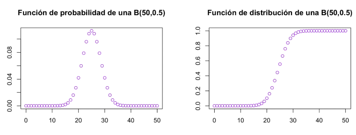
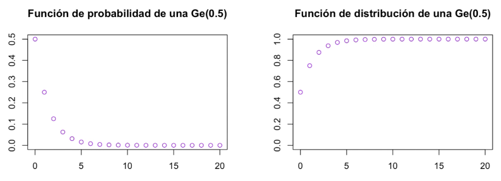
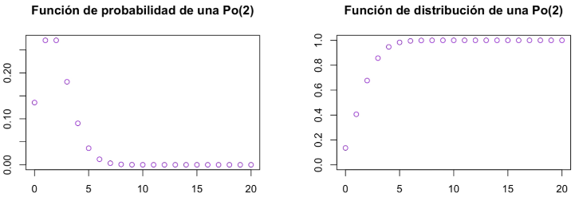

```{r setup, include=FALSE}
knitr::opts_chunk$set(echo = TRUE)
```

# El concepto de probabilidad

#### Experimento aleatorio

* **Experimento aleatorio**. Experimento efectuado en las mismas condiciones puede dar lugar a resultados diferentes

* **Suceso elemental** Cada uno de los posibles resultados del experimento aleatorio

* **Espacio muestral** Conjunto $\Omega$ formado por todos los sucesos elementales del experimento aleatorio

**Ejemplo**:

- Lanzar una moneda es un experimento aleatorio

- Los sucessos elementales son: Sacar Cara $C$ y sacar Cruz $+$

- El espacio muestral de este experimento aleatorio es $\Omega = \{ C, + \}$

#### Sucesos

* **Suceso**. Subconjunto del espacio muestral

* **Suceso total o seguro**. $\Omega$

* **Suceso vacío o imposible** $\emptyset$

**Ejemplo**:

- Lanzar un dado es un experimento aleatorio

- Algunos sucesos podrian ser: Sacar número par ({2,4,6}), sacar mayor que 4 ({5,6}), sacar número multiplo de 3 ({3,6})...

- El suceso total de este experimento aleatorio es $\Omega = \{ 1,2,3,4,5,6 \}$

- Un ejemplo de suceso imposible de este experimento aleatorio es $\emptyset = \{ 7 \}$ (Sacar 7) 

* *Operaciones con sucesos*. Sean $A,B \ \subseteq \ \Omega$ sucesos. Entonces,

* $A \ \cup \ B$ es el suceso unión (Resultados pertenecen a A, o a B, o a ambos)

* $A \ \cap \ B$ es el suceso intercección (Resultados pertenecen a A y B)

* $A^c$ Es el suceso complementario (Resultados que no pertenecen a A)

* $A-B=A \ \cap \ B^c$ Es el suceso diferencia (Resultados qu epertenecen a A pero no a B) 

* *Sucesos incompatibles* Si $A \ \cap \ B = \emptyset$

#### Probabilidad

**Probabilidad de un suceso**. Número entre 0 y 1 (ambos incluidos) que mide la expectativa de que se dé este suceso

**Ejemplo**:

* La probabilidad de sacar un 6 al lanzar un dado estándar no trucado es $\frac{1}{6}$

* La probabilidad de sacar un 6 al lanzar un dado de 4 caras es 0

* La probabilidad de sacar un 6 al lanzar un dado de 20 caras es $\frac{1}{20}$


**Probabilidad**. Sea $\Omega$ el espacio muestral de un experimento aleatorio. Suponiendo que $\Omega$ es *finito*, una probabilidad sobre $\Omega$ es una aplicación

* $p$ = Partes

$$p=P(\Omega) \longrightarrow [0,1]$$

que satisface:

* $0 \leq \rho(A) \leq 1 \ \forall A \in P (\Omega)$

* $p(\Omega)=1$

* Si $\{ A_1,...,A_n \}$ son sucesos incompatibles dos a dos $(A_i \cap A_j = \emptyset \forall_i \neq j)$, entonces

$$p (A_1 \cup \cdots \cup A_n) = p(A_1) + \cdots + p(A_n)$$

*Notación*: Si $a \in \Omega$, escribiremos $p(a)$ en vez de $p(\{ a \})$


# Variables aleatorias y funciones de distribución

#### Variables aleatorias

**Variable aleatoria**. Una variable aleatoria (v.a.) sobre $\Omega$ es una aplicación

$$X : \Omega \longrightarrow \mathbb{R}$$

que asigna a cada suceso elemental $\omega$ un número real $X(\omega)$

Puede entenderse como una descripción numérica de los resultados de un experimento aleatorio

**Dominio de una variable aleatoria**. $D_x$, es el conjunto de los valores que puede tomar

#### Sucesos de variables aleatorias

Una variable aleatoria puede definir sucesos, de los cuales queremos conocer la probabilidad $p$

* $p(X=a) = p( \{ \omega \in \Omega \mid X(\omega)=a \})$
* $p(X < b) = p( \{ \omega \in \Omega \mid X(\omega) < b \})$
* $p(X \le b) = p( \{ \omega \in \Omega \mid X(\omega) \le b \})$
* $p(a < X) = p( \{ \omega \in \Omega \mid a < X(\omega) \})$
* $p(a \le X) = p( \{ \omega \in \Omega \mid a \le X(\omega) \})$
* $p(a \le X \le b) = p( \{ \omega \in \Omega \mid a \le X(\omega) \le b \})$
* $p(a < X < b) = p( \{ \omega \in \Omega \mid a < X(\omega) < b \})$
* $p(X \in A) = p( \{ \omega \in \Omega \mid X(\omega) \in A \})$

#### Función de distribución

**Función de distribución de la v.a. X.** Es una función

$$F : \mathbb{R} \longrightarrow [0,1]$$

definida por $F(x) = p(X \le x)$

Sea $F$ una función de distribuciónd e una v.a.X y digamos

$$F(\bar{a}) = \lim_{x \to \bar{a}} F(x)$$

* $p(X \le a) = F(a)$

* $p(X < a) = $
  $\lim_{b \to a, b<a} p(X \le b) =$ 
  $\lim_{b \to a, b<a} F(b) = $
  $F(a^-)$ F de a por la izquierda

* $p( X = a) = p(X \le a) - p(X <a) = F(a) - F(a^-)$ F de a por la izquierda

* $p(a \le X \le) = p(X \le b) - p(X < a) = F(b) - F(a^-)$ F de a por la izquierda

#### Cuantiles

**Cuantil de orden p de una v.a.X.** Es el $x_p \in \mathbb{R}$ más pequeño tal que $F(x_p) \ge p$

Nótese que la mediana es el cuantil de orden 0.5

# Variables aleatorias discretas 

* **Variable aleatoria discrta**. Una v.a.X: $\Omega \longrightarrow \mathbb{R}$ es discreta cuando $D_x$ es finito o un subconjunto de $\mathbb{N}$

* **Función de densidad**. Es la función f: $\mathbb{R} \longrightarrow [0,1]$ definida por

$$f(x)=p(X=x)$$
Nótese que $f(x)=0$ si $x \notin D_x$. Por tanto, interpretaremos la función de densidad como la función

$$f:D_x \longrightarrow [0,1]$$

#### Esperanza

**Esperanza de una v.a. discreta.** Sea $f:D_x \longrightarrow [0,1]$ la densidad de X, entonces la esperanza respecto de la densidad es la suma ponderada de los elementos de $D_x$, multiplicando cada elemento de $x$ de $D_x$ por su probabilidad,

$$E(X)= \sum_{x \in D_x} x \cdot f(x) $$

Si $g: D_x \longrightarrow \mathbb{R}$ es una aplicación

$$E(g(X)) = \sum_{x \in D_x} g(x) \cdot f(x)$$

#### Varianza

**Varianza de una v.a. discreta**. Sea $f:D_x \longrightarrow [0,1]$ la densidad de $X$, entonces la varianza respecto de la densidad es el valor esperador de la diferencia al cuadrado entre $X$ y su valor medio $E(X)$

$$Var(X) = E((X - E(X))^2)$$

La varianza mide como de variados son los resultados de $X$ respecto de la media

###### Ejercicio. Demostar la siguiente igualdad

$$Var(X) = E(X^2) - (E(X))^2$$

Si $X$ es una v.a. discreta y $g: D_x \longrightarrow \mathbb{R}$ una función,

$$Var(g(X)) = E((g(X) - E(g(X)))^2) = E(g(X)^2) - (E(g(X)))^2$$

#### Desviación típica

**Desviación típica de una v.a. discreta**. Sea $F: D_x \longrightarrow [0,1]$ la densidad de $X$, entonces la desviación tipica respecto de la densidad es

$$\sigma(X) = \sqrt{Var(X)}$$

Las unidades de la varianza son las de $X$ al cuadrado. En cambio, las de la desviación típica son las mismas unidades que las de $X$

Si $X$ es una v.a. discreta y $g: D_x \longrightarrow \mathbb{R}$ una función,

$$\sigma(g(X)) = \sqrt{Var(g(X))}$$
# (Contenido abajo vimos solamente por wikipedia)
El sesgo(Skewness) de una distribución de probabilidad
Curtosis

# Introducción a las distribuciones de probabilidad

#### Distribuciones en R

Dada cualquier variable aleatoria, v.a., `R` nos da cuatro funciones para poder trabajar con ellas:

* `dva(x,...)`: Función de densidad o de probabilidad `f(x)` de la variable aleatoria para el valor `x` del dominio de definición.

* `pva(x,...)`: Función de distribución `F(x)` de la variable aleatoria para el valor `x` del dominio de definición.

* `qva(p,...)`: Cuantil `p-ésimo` de la variable aleatoria (el valor de `x` más pequeño tal que $F(x) \geq p$).

* `rva(n,...)`: Generador de `n` observaciones siguiendo la distribución de la variable aleatoria.

#### Distribuciones en Python

Dada cualquier variable aleatoria, en `Python` tenemos las mismas cuatro funciones, sin que su nombre dependa de la misma:

* `pmf(k,..)` o `pdf(x,...)`: Función de probabilidad $f(k)$ o de densidad $f(x)$ de la variable aleatoria para los valores `k` o `x` del dominio.

* `cdf(p,...)`: Función de distribución `F(x)` de las variables aleatoria para el valor `k` del dominio.

* `ppf(p,...)`: Cuantil `p-ésimo` de la variable aleatoria (El valor de `x` más pequeño tal que $F(x) \ge p$).

* `rvs(size,...)`: Generador de `n` observaciones siguiendo la distribución de la variable aleatoria.


# La distribución de Bernoulli

Si `X` es variable aleatoria que mide el (número de éxitos) y se realiza un único experimento con dos posibles resultados (éxito, que toma valor 1, o fracaso, que toma valor de 0), diremos que `X` se distribuye como una bernoulli con parámetro `p`

$$X \sim Be(p)$$

donde `p` es la probabilidad de éxito y `q= 1-p` es la probabilidad de fracaso.

* *El dominio* de `X` será $X(\Omega) = \{ 0,1 \}$
* *La función de probabilidad* vendrá dada por

$$f(k)=p^k(1-p)^{1-k}
\left\{\begin{array}{l}
                        p & \text{si }k= 1
                        \\
                        1-p & \text{si }k= 0
                        \\
                        0 & \text{en cualquier otro caso}
\end{array}\right.$$


* *La función de distribución* vebdrpa dada por

$$f(k)=
\left\{\begin{array}{l}
                        0 & \text{si }k< 0
                        \\
                        q & \text{si }0 \le k \le 1
                        \\
                        1 & \text{si }k \ge 1
\end{array}\right.$$

* *Esperanza E(X) = p*

* *Varianza Var(X) = pq*

#### El código de la distribución de Bernoulli
*(Sección 16 - Video 163, minuto 6)*
* En `R` tenemos las funciones del paquete 
  - `Rlab:`
    - `dbenr(x,prob),` 
    - `pbenr(q,prob),` 
    - `qbenr(q,prob),`
    - `rbenr(n, prob)`
    donde `prob` es la probabilidad de exito

* En `Python` tenemos las funciones del paquete    
  - `scipy.stats.bernoulli:`
    - `pmf(k,p)`
    - `cdf(k,p)`
    - `ppf(q,p)`
    - `rvs(p,size)`
    donde `p` es la probabilidad de exito

#### Función de densidad Bernoulli

$$f(k) = p^k(1-p)^{1-p}, \ k \in \ \{ 0,1 \}$$

Sea $X = Be(p = 0.7)$, la distribución que modela la probabilidad de obtener una cara usando una moneda trucada.

###### En R

1) Instalo el paquete `Rlab`


```{r}
library(Rlab)

dbern(0, prob = 0.7)
dbern(1, prob = 0.7)
pbern(0, prob = 0.7) #Probabilidades
pbern(1, prob = 0.7) #Probabilidades
qbern(0.5, prob = 0.7) #quantiles
qbern(0.25, prob = 0.7) #quantiles
rbern(100, prob = 0.7) #Numeros aleatorios
hist(data)
```


###### En python

```{python}
from scipy.stats import bernoulli
import matplotlib.pyplot as plt

p = 0.7
mean, var, skew, kurt = bernoulli.stats(p, moments = 'mvsk')
print("Media %f",mean)
print("Varianza %f",var)
print("Sesgo %f",skew)
print("Curtosis %f",kurt)

fix, ax = plt.subplots(1,1)
x = bernoulli.rvs(p, size = 1000)
ax.hist(x)
plt.show()
```


# Distribución Binomial

Si `X` es variable aleatoria que mide el "número de exitos" y se realizan n ensayos de Bernoulli independientes entre si, diremos que `X` se distribuye como una Binomial con parámetros `n` y `p`

$$X \sim B(n,p)$$

donde`p` es la probabilidad de éxito y $q = 1-p$ es la probabilidad de fracaso.

* El *dominio* de `X` será $Dx= \{ 0,1,2,...,n \}$
* La *función de densidad* vendrá dada por 

$$f(k) = \left( \frac{n}{k} \right) p^k(1-p)^{n-k}$$

* La *función de distribución* vendrá dada por

$$F(x)=
\left\{\begin{array}{l}
                        0 & \text{si }x< 0
                        \\
                        \sum^x_{k=0}f(x) & \text{si }0 \le x < n
                        \\
                        1 & \text{si }x \ge 1
\end{array}\right.$$

* *Esperanza* E(X) = np
* *Varianza* Var(X) = npq

*Atención*, Fijaos que la distribución de Bernoulli es un caso particular de la Binomial. Basta tomar n=1 y tendremos que $X \sim Be(p)$ y $X \sim B(1,p)$ son equivalentes.



El código de la distribución Binomia:

* En `R` tenemos las funciones del paquete `Rlab`:     
  - `dbinom(x,size,prob)` 
  - `pbinom(q,size,prob)`
  - `qbinom(p,size,prob)`
  - `rbinom(n,size,prob)`
donde `prob` es la probabilidad de éxito y `size` el número de ensayos del experimento

* En `Python` tenemos las funciones del paquete `scipy.stats.binomia`:
  - `pmf(k,n,p)`
  - `cdf(k,n,p)`
  - `ppf(q,n,p)`
  - `rvs(n,p,size)`
donde `p` es la probabilidad de éxito y `n` el número de ensayos del experimento.

#### Función de densidad Binomial

Sea $X = B(n = 30, p = 0.6)$,

TODO: Escribir la función de densidad, y la función de distribución acumulada.

###### En `R`

```{r :Distribución binomial}
library(Rlab)

n = 30
p = 0.6

#Grafica 1
plot(0:n, 
     dbinom(0:n, 
            size = n, 
            prob = p)
     )

# Grafica 2

plot(0:n, 
     pbinom(0:n, 
            size = n, 
            prob = p)
     )

# Calculando los cuantiles

qbinom(0.5, n, p)
qbinom(0.25, n, p)

# Graficando y Generando numeros aleatorios 

hist(rbinom(100000, n, p), braks = 0:30)

```

###### En Python

```{python a PMF función de densidad}
from scipy.stats import binom
import matplotlib.pyplot as plt
import numpy as np

fig, ax = plt.subplots(1,1)
n = 7
p = 0.4

mean, var, skew, kurt = binom.stats(n,p, moments = 'mvsk')

print("Media %f",mean)
print("Varianza %f",var)
print("Sesgo %f",skew)
print("Curtosis %f",kurt)

x = np.arange(binom.ppf(0.01, n,p), binom.ppf(0.9999, n,p))

ax.plot(x, binom.pmf(x, n, p), 'bo', ms = 8, label = 'Función de densidad de B(7, 0.4)')
ax.vlines(x, 0, binom.pmf(x,n,p), colors = 'b', lw= 4, alpha = 0.5)

rv = binom(n,p)
ax.vlines(x,0, rv.pmf(x), colors = 'k', linestyles = '--', lw = 1, label = 'Distribución teorica')

ax.legend(loc = 'best', frameon = False)

plt.show()

```


```{python a CDF función de densidad acumulada}
from scipy.stats import binom
import matplotlib.pyplot as plt
import numpy as np

fig, ax = plt.subplots(1,1)
n = 7
p = 0.4

mean, var, skew, kurt = binom.stats(n,p, moments = 'mvsk')

print("Media %f",mean)
print("Varianza %f",var)
print("Sesgo %f",skew)
print("Curtosis %f",kurt)

x = np.arange(binom.ppf(0.01, n,p), binom.ppf(0.9999, n,p))

ax.plot(x, binom.cdf(x, n, p), 'bo', ms = 8, label = 'Función de densidad de B(7, 0.4)')
ax.vlines(x, 0, binom.cdf(x,n,p), colors = 'b', lw= 4, alpha = 0.5)

rv = binom(n,p)
ax.vlines(x,0, rv.pmf(x), colors = 'k', linestyles = '--', lw = 1, label = 'Distribución teorica')

ax.legend(loc = 'best', frameon = False)

plt.show()

```
  
```{python a pmf función de densidad}

from scipy.stats import binom
import matplotlib.pyplot as plt
import numpy as np

fig, ax = plt.subplots(1,1)
n = 7
p = 0.4

mean, var, skew, kurt = binom.stats(n,p, moments = 'mvsk')

print("Media %f",mean)
print("Varianza %f",var)
print("Sesgo %f",skew)
print("Curtosis %f",kurt)

x = np.arange(binom.ppf(0.01, n,p), binom.ppf(0.9999, n,p))

ax.plot(x, binom.pmf(x, n, p), 'bo', ms = 8, label = 'Función de densidad de B(7, 0.4)')
ax.vlines(x, 0, binom.pmf(x,n,p), colors = 'b', lw= 4, alpha = 0.5)

rv = binom(n,p)
ax.vlines(x,0, rv.pmf(x), colors = 'k', linestyles = '--', lw = 1, label = 'Distribución teorica')

ax.legend(loc = 'best', frameon = False)

plt.show()

fiz, ax = plt.subplots(1,1)
r = binom.rvs(n, p, size = 10000)
ax.hist(r, bins = n)
print(r)

```

# Distribución Geométrica

* La *función de distribución* vendrá dada por

$$F(x) = 
\left\{\begin{array}{l}
                        0 & \text{si }x< 0
                        \\
                        1-(1-p)^{k+1} & \text{si }k \le x < k+1, \  k \in \mathbb{N}
\end{array}\right.$$

* *Esperanza*  $E(X) = \frac{1-p}{p}$ si empieza en $0$ y $E(X)= \frac{1}{p}$ si empieza en 1

* *Varianza* $Var(X) = \frac{1-p}{p^2}$

* *Propiedad de la falta de memoria* Si $X$ es una `v.a Ge(p)` entonces,

$$p \{ X \ge m+n : X \ge n \} = p \{ X \ge m \} \ \forall m, n = 0,1,... $$

Si `X` es variable aleatoria que mide el `"número de repeticiones independientes del experimento hasta haber conseguido éxito"`, diremos que `X` se distribuye como una Geométrica con prámetro `p`

$$X \sim Ge(p)$$

donde `p` es la probabilidad de éxito y $q = 1-p$ es la probabilidad de fracaso.

* El *dominio* de `X` será $D_x = \{ 0,1,2,... \}$ o bien $D_x = \{ 1,2,... \}$ en función de si empieza en 0 o en 1, respectivamente.

* La *función de densidad* vendrá dada por

$$
\begin{array}{c}
                  f(k)=(1-p)^kp & \text{si empieza en 0}
                  \\
                  f(k)= 1-(1-p)^{k-1}p & \text{si empieza en 1}
\end{array}$$



El código de la distribución Geométrica:

* En `R` tenemo las funciones del paquete `Rlab`:
    - `dgeom(x, prob)`
    - `pgeom(q, prob)`
    - `qgeom(p, prob)`
    - `rgeom(n, prob)`
donde `prob` es la probabilidad de éxito del experimento.

* En `Python` tenemos las funciones del paquete `scipy.stats.geom`:
    - `pmf(k, p)`
    - `cdf(k, p)`
    - `ppf(q, p)`
    - `rvs(p, size)`
donde `p` es la probabilidad de éxito del experimento.

#### Función de densidad Geometrica

Sea $X = Geom(p=0.1)$ la distribución que modela la probabilidad de intentar abrir una puerta hasta conseguirlo

$$f(k) = (1-p)^{k-1}p$$

###### En R

```{r Función de densidad geometrica en Rstudio}
library(Rlab)
p = 0.1
plot(0:10, dgeom(0:10, p))
plot(0:20, pgeom(0:20, p), ylim = c(0,1))
qgeom(0.5, p)
qgeom(0.75, p)
hist(rgeom(10000, p))
```

###### En Python

```{python Función de densidad geometrica}
from scipy.stats import geom
import matplotlib.pyplot as plt
import numpy as np

fig, ax = plt.subplots(1,1)
p = 0.3
mean, var, skew, kurt = geom.stats(p, moments = 'mvsk')

print("Media %f",mean)
print("Varianza %f",var)
print("Sesgo %f",skew)
print("Curtosis %f",kurt)

x = np.arange(geom.ppf(0.01, p), geom.ppf(0.99,p))
ax.plot(x, geom.pmf(x, p), 'bo', ms = 8, label = 'Función de probabilidad de Geom(0.3)')
ax.vlines(x, 0, geom.pmf(x, p), colors ='b', lw = 4, alpha = 0.5)

rv = geom(p)
ax.vlines(x, 0, rv.pmf(x), colors = 'k', linestyles = '--', lw = 1, label ='Frozem PMF')

ax.legend(loc = 'best')
plt.show()


```

```{python Geometrica acumulada}

fig, ax = plt.subplots(1,1)
prob = geom.cdf(x,p)
ax.plot(x, prob, 'bo', ms = 8, label = 'Función de distribución geometrica acumulada')
plt.show()

```


```{python Con valores Aleatorios}

fig, ax = plt.subplots(1,1)
r = geom.rvs(p, size = 10000)
plt.hist(r)
plt.show()

```

# Distribución Hipergeométrica

Consideremos el experimento "extraer a la vez (o uno detrás de otra, sin retornarlos) `n` objetos donde hay `N` de tipo `A` y `M` de tipo `B`". Si `X` es variable aleatoria que mide el "número de objetos del tipo A", diremos que `X` se distribuye como una Hipergeométrica con parámetros `N`, `M`, `n`

$$X \sim H(N,M,n)$$

* El *dominio* de `X` será $D_x=\{ 0,1,2,...,N \}$ (en general)
* La *función de densidad* vendrá dada por

$$f(k)= \frac{ (\frac{N}{k})(\frac{M}{n-k}) }{ (\frac{N+M}{n}) }$$

* La *función de distribución* vendrá dada por

$$F(x) = 
\left\{\begin{array}{l}
        0 & \text{si }x< 0
        \\
        \sum^x_{k=0}f(k) & \text{si }0 \le x < n
        \\
        1 & \text{si }x\ge n
\end{array}\right.$$

* *Esperanza* $E(X)=\frac{nN}{N+M}$
* *Varianza* $Var(X)= \frac{nNM}{(N+M^2)} \cdot \frac{N+M-n}{N+M-1}$


El código de la distribución Hipergeométrica:

* En `R` tenemos las funciones del paquete `Rlab`:
    - `dhyper(x, m, n, k)`
    - `phyper(q, m, n, k)`
    - `qhyper(p, m, n, k`
    - `rhyper(nn, m, n, k)`
donde `m` es el número de objetos del primer tipo, `n` el número de objetos del segundo tipo y `k` el número de extracciones realizadas.

* En `Python` tenemos las funciones del paquete `scipy.stats.hypergeom`:
    - `pmf(k, M, n, N)`
    - `cdf(k, M, n, N)`
    - `ppf(q, M, n, N)`
    - `rvs(M, n, N, size)`
donde `M` es el número de objetos del primer tipo, `N` el número de objetos del segundo tipo y `n` el número de extracciones realizadas.

#### Ejemplo de distribución hipergeometrica

###### En R
Supongamos que tenemos 20 animales, de los cuales 7 son perros. Queremos medir la probabilidad de encontrar un número determinado de perros si elegimos $k=12$ animales al azar

```{r Distribución hipergeometrica}
library(Rlab)
M = 7
N = 12
k = 12
dhyper(x = 0:12, m= M, n = N, k = k) #Distribución hipergeometrica
phyper(q = 0:12, m= M, n = N, k = k) #Acumulada
qhyper(p = 0.5, m= M, n = N, k = k)
rhyper(nn = 1000, m= M, n = N, k = k) -> data #Con valores aleatorios
hist(data, breaks = 8)
```


###### En Python

```{python Distribución hypergeometrica}
from scipy.stats import hypergeom
import matplotlib.pyplot as plt
import numpy as np

[M, n, N] = [20, 7, 12]
rv = hypergeom(M, n, N)
x = np.arange(0, n+1)
y = rv.pmf(x)

mean, var, skew, kurt = rv.stats(moments = 'mvsk')

print("Media %f",mean)
print("Varianza %f",var)
print("Sesgo %f",skew)
print("Curtosis %f",kurt)

fig = plt.figure()
ax = fig.add_subplot(111)
ax.plot(x, y, 'bo')
ax.vlines(x, 0, y, lw = 2, alpha = 0.5)
ax.set_xlabel('Número de perros entre los 12 elegidos al azar')
ax.set_ylabel('Distribución de probabilidad de H(13, 7, 12)')
plt.show()
```

# La distribución Poisson

Si `X` es variable aleatoria que mide el "número de eventos en un cierto intervalo de tiempo", diremos que `X` se distribuye como una Poisson con parámetro $\lambda$

$$X \sim Po( \lambda )$$

donde $\lambda$ representa el número de veces que se espera que ocurra el evento durante un intervalo dado:

* El *dominio* de `X` será $D_x = \{ 0,1,2,... \}$
* La *función de densidad* vendrá dada por

$$f(k)= \frac{e^{- \lambda} \lambda^k}{K!}$$

* La *función de distribución* vendrá dada por

$$F(x) = 
\left\{\begin{array}{l}
        0 & \text{si }x< 0
        \\
        \sum^x_{k=0}f(k) & \text{si }0 \le x < n
        \\
        1 & \text{si }x\ge n
\end{array}\right.$$

* *Esperanza* $E(X)= \lambda$
* *Varianza* $Var(X) = \lambda$



El código de la distribución de Poisson:

* En `R` tenemos las funciones del paquete `Rlab`:
    - `dpois(x, lambda)`
    - `ppois(q, lambda)`
    - `qpois(p, lambda)`
    - `rpois(n, lambda)`
donde `lambda` es el número esperado de eventos por unidad de tiempo de la distribución

* En `Python` tenemos las funciones del paquete `scipy.stats.poisson:`
    - `pmf(k, mu)`
    - `cdf(k, mu)`
    - `ppf(q, mu)`
    - `rvs(M, mu)`
donde `mu` es el número esperado de eventos por unidad de tiempo de la distribución

###### En R

Supongamos que $X$ modela el número de errores por página que tiene un valor esperado $\lambda = 5$

```{r Ejemplo de distribución de Poisson en R}
library(Rlab)
l = 5
plot(0:20, dpois(x = 0:20, lambda = l))
ppois(0:20, lambda = l)
qpois(0.5, 5)
rpois(1000, lambda = l) -> data
hist(data)
```

###### En Python

```{python Ejemplo de la distribución de Poisson en Python}
from scipy.stats import poisson
import matplotlib.pyplot as plt
import numpy as np

fig, ax = plt.subplots(1,1)
mu = 0.8

mean, var, skew, kurt = poisson.stats(mu, moments = 'mvsk')

print("Media %f",mean)
print("Varianza %f",var)
print("Sesgo %f",skew)
print("Curtosis %f",kurt)

x = np.arange(0, 5)
ax.plot(x, poisson.pmf(x, mu), 'bo', ms = 8, label = 'Poisson(0.8)')
ax.vlines(x, 0, poisson.pmf(x,mu), colors = 'b', lw = 4, alpha = 0.5)
ax.legend(loc = 'best', frameon = False)
plt.show()

```


  