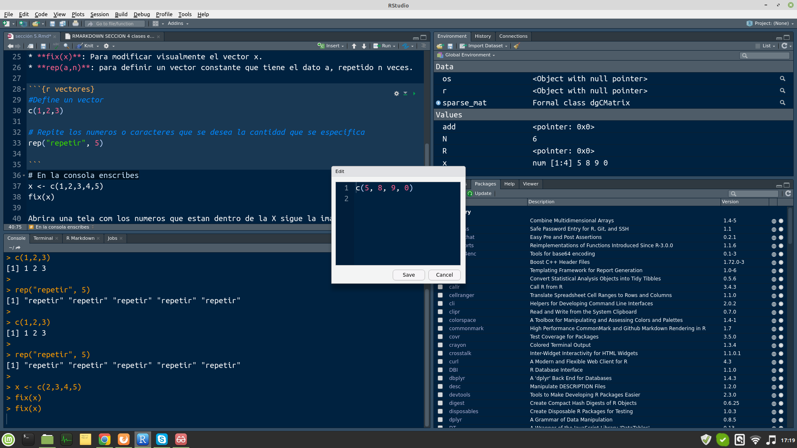
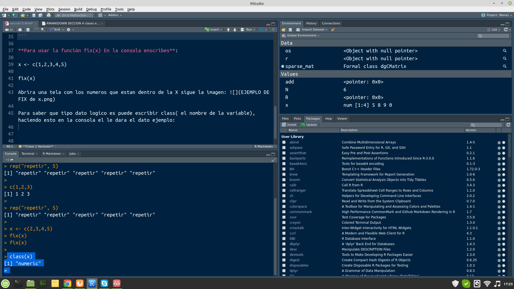

```{r setup, include=FALSE}
knitr::opts_chunk$set(echo = TRUE)
```

# Estructuras de datos en Rstudio

###### Tipos de datos en R
  
Un **vector** es una secuencia ordenada de datos. `R` dispone de muchos tipos de datos, por ejemplo:
  
* **logical**: false or true

* **integer**: numeros enteros $\mathbb{Z}$

* **numeric**: numeros reales $\mathbb{R}$

* **complex**: numeros complejos $\mathbb{C}$

* **character**: palabras

En los vectores de `R` todos sus objetos han de ser el mismo tipo: todos números, todos palabras, etc. Cuando queramos usar vectores formados por objetos de diferentes tipos, tendremos que usar **listas generalizadas**, `lists` que veremos al final del tema.

###### Básico

* **c()**: Para definir un vector.
* **scan()**: Para definir un vector.
* **fix(x)**: Para modificar visualmente el vector x.
* **rep(a,n)**: para definir un vector constante que tiene el dato a, repetido n veces.

```{r vectores y función rep}
#Define un vector
c(1,2,3)

# Repite los numeros o caracteres que se desea la cantidad que se especifica  
rep("repetir", 5)
?scan #Help de scan
```

**Para usar la función fix(x) En la consola enscribes**:

**x <- c(1,2,3,4,5)**

**fix(x)**

Abrira una tela com los numeros que estan dentro de la X sigue la imagen: 



Para saber que tipo dato logico es puede escribir class( el nombre de la variable), haciendo esto en la consola el le dara el dato ejemplo: 



Ejercicio simple:
* Repetir el año de nacimiento 10 veces
* Crear un vector con los numero 16,0,1,20,1,7,88,5,1,9

```{r Respuestas del ejercicio simple}

rep(1988,10)
vec <- c(16,0,1,20,1,7,88,5,1,9)
print(vec)
```


###### Progresiones y secuencias

Una prograsión aritmética es una sucesión de números tales que la **diferencia, d**, de cualquier par de términos sucesivos de la secuencia es constante.  $$a_{n}=a_{1}+(n+1)\cdot d$$

* **seq(a, b, by=d)**: Para generar una progresion arimetica de diferencia `d`, que empieza en `a` y termina en `b`

* **seq(a, b, length.out=n)**: Donde define una progresión arimetica de longitud `n` que va desde `a` hasta `b` con diferencia d por lo tanto $d=(a-b)/(n-1)$

* **seq(a, by=d, length.out=n)**: Define la progresión aritmetica de longitud `n` y diferencia `d` que empieza en `a`

* **a:b**: Secuencia de numeros enteros $\mathbb{Z}$ desde `a` hasta `b`

```{r ejemplo de progresion aritmetica}

## Secuencia de numeros del 1 al 20
x = 1:20 #genera un vector
print(x) #Vector de 1 hasta 20

## secuencia creciente
seq(2,   # comienza de 2
    20,  #que lleguen hasta 20
    by = 2) #y saltos de 2 en 2

## secuencia decreciente
seq(20,   # comienza de 20
    2,  #que lleguen hasta 2
    by = -2) #y saltos de -2 en -2

## Primeros 30 numeros que van desde el 17 hasta el 98 mostrando solo 4 cifras significativas

a = 17
b = 98
n = 30

z = seq(a, #Numero inicial
        length.out = n, #Longitud de la secuencia en este caso deve mostrar 30 numeros
        by = 3) #saltos de 3 en 3
z

t = seq(a, #Numero inicial
        b, #Numero final
        length.out = n) #Cantidad de numeros a mostrar 
t #Da una secuencia desde 17 hasta 98 con 30 numeros
signif(t, digits = 6) #Imprime t con las 4 sifras significativas, se coloca 6 porque cuenta desd el entero hasta la 4ta cifra significativa. es decir 00,0000

```

###### Funciones

Cuando queremos aplicar una función a cada uno de los elementos de un vector de datos. la función **sapply** nos ahorra tener que programar con bucles en `R`.
    
* **sapply(nombre_de_vector, FUN= nombre_de_función)**: Para aplicar dicha función en todos los elementos del vector.
* **sqrt(x)**: Calcula un nuevo vector con las raicez cuadradas de cada elemento del vector `x`.

Dado un vector de datos, podemos calcular muchas medidas estadisticas ejemplo:

* **length(x)**: Calcula la longitud del vector x
* **max(x)**: Calcula el maximo del vector x
* **min(x)**: Calcula el minimo del vector x
* **sum(x)**: Calcula la suma de las entradas del vector x
* **prod(x)**: Calcula el producto *Multiplicación* de las entradas del vector x
* **mean(x)**: Calcula la media del vector x
* **diff(x)**: Calcula el vector formado por las diferencias sucesivas entre entradas del vector original x
* **cumsum(x)**: Calcula el vector formado de las sumas acumuladas de las entradas del vector original x.
  - Permite definir suceciones descritas mediante sumatorios
  - Cada entrada de *cumsum(x)* es la suma de las entradas del vector original *x* hasta su posición.

```{r Ejemplo de funciones}
v = c(1,2,3,4,5,6,7,8,9,10)
#Aplicando operaciones matematicas al vector
v + pi #sumo pi al vector
v * pi #multiplico pi por el vector
sqrt(v) #Saco la raiz cuadrada del vector
2^v #Elevo 2 a cada item del vector
v^2 #Elevo cada iten del vector al cuadrado

#Otras operaciones matematicas para el vector
v1= c(1,2,3,4,5,6,7,8,9,10)
max(v1) #Valor maximo de v1
min(v1) #Valor minimo de v1
sum(v1) #suma del vector
prod(v1) #Producto del vector v1
mean(v1) #Media del vector v1
sum(v1)/length(v1)#Otra forma de determinar la Media del vector v1

## Calculo  el acumulado de ve donde es 1+2 = 3, 3+3 = 4, ......n+(n-1)
cumsum(v1) #suma acumulada del vector v1
diff(v1) #diferencias de 1 numero para otro, el resultado es 1 porque eso es lo que tiene pero si tuviera otras diferencias ejemplo:
diff(cumsum(v1)) #Corri la posición para 2 y asi aparece ese valor

## Aplicando funciones al vector
cuadrado = function(x){x^2} #Creo una función para elevar al cuadrado
sapply(v, FUN= cuadrado) #Aplico la funcion creada de elevar al cuadrado
```


###### Orden

* **sort(x)**: Ordena el vector numericamente o alfabeticamente
* **rev(x)**: Invierte el orden de los elementos del vector.

```{r Ejercicios de Orden}
v= c(1,9,3,34,0,6,67,34,9,10)
###### Ordena el valor de v
t = sort(v) #Orden creciente
print(t) 

###### Altera el valor del orden de v
rev(t) #Orden decreciente

t1 = sort(v, decreasing = TRUE) #Otro Orden decreciente
print(t1)

?sort
```


###### Ejecicio de Binomio de Newton

**Producto Notable**

Formula de producto notable: 
$$(a+b)^2 = a^2+2\cdot(a)\cdot(b)+b^2$$

```{r producto notable}
pd= function(a,b){
  a^2+2*a*b+b^2
  }
pd(1,2)

print(pd)
```

**Binomio de Newton**

Formula es: $$(a+b)^n= \sum_{k=0}^n {n\choose k} \cdot a^{n-k} \cdot b^k = {n\choose 0}\cdot a^n\cdot b^0+\cdots {n\choose n}\cdot a^0 \cdot b^n$$

```{r Binomio de Newton}
BN = function(a,b,n){
  cumsum(choose(n,{0:n})*a^{n-(0:n)}*b^(0:n))[n+1]
  
}
######cumsum(choose(n,{0:n})*a^{n-(0:n)}*b^(0:n))**[n+1]** se agrega ese n+1 para que no arroje el valor como vector. 
###### Resultado:
BN(2,1,2)
```

###### Subvectores

* **vector[i]**: De la i-ésima entrada del vector
  - Los indices de R empiezan en 1
  - **vector[length(vector)]**: Nos da la ultima entrada del vector
  - **vector[a,b]**: *a* y *b* son dos numeros naturales que nos dan la posición del vector
  - **vector[-i]**: 
    -Si *i* es un numero, es para que cuando llame la función no aparesca el vector que esta en la posición *i*. 
    -Si *i* resulta ser un vector, entonces es un vector de indices creando un nuevo vector con entradas del vector original.
  - **vector[-x]**: Si x es un vector de indices, entonces es el complementario del vector x
  
Tambien es posible utilizar operadores lógicos

- `==` : =
- `!=` : $\neq$
- `>=` : $\geq$
- `<=` : $\leq$
- `<` : $<$
- `>` : $>$
- `!` : NO lógico
- `&` : Y lógico
- `|` : O lógico


```{r Ejemplo de subvectores}
v = c(1,5,3,2,15,20,13,25)

v[2] ##Da como resultado el vector que esta en la posición 2 que en este caso es *5*

v[-c(3,5)] ## Los vectores que estan en la posición 3 y 5 no van a aparecer cuando llamen esa función

v[v != 15 & v> 13] ##  van a aparecer los vectores mayor que 13 pero quitando el 15 ya que no puede tener ese numero
```

```{r Operaciones simples de filtrado de vectores y operadores logicos}
x = seq(3, #Empieza en 3
        50,  #Termina en 50
        by = 3.5) #Cada separación de 3,5 en 3,5
x

#Resultado de la posición 3 y 8 del vector x
x[3]
x[8]
# ver la ultima entrada del vector x
x[length(x)]

# ver la penultima entrada del vector x
x[length(x)-1]

#Para eliminar el tercer valor del vector
x[-3]

#Para solo tener los valores del 4 al 8
x[4:8]

#Puedo hacer el ejemplo anterior como cuenta regresiva del 8 al 4
x[8:4]

# Determinar los numeros de posición par
x[seq(2, #Inicia en 2
      length(x), #Longitud x
      by = 2)] #Salto de 2 en 2

# Determinar los numeros de posición impar
x[seq(1, #Inicia en 1
      length(x),  #Longitud x
      by = 2)] #Salto de 2 en 2

# Otra forma de posición impar solo agregar un (-seq) Lo que hace es eliminar los pares 
    x[-seq(2, 
      length(x), 
      by = 2)] 

# Determinar los ultimos 4 elementos del vector
  x[
  (length(x)-3) # Cuidar los parentices para que de el valor correcto. (length(x)-3)
  :
  length(x)
  ] 

#Filtrar los valores que estan en la posición 1 , 5 y 6
x[c(1,5,6)]

#filtrar por condicional
x[x>30] #Filtra y da como valor los mayores a 30
x[x>30 & x<40] #Filtra los valores > 30 pero < 40
x[x!=17 & x !=38] #quita todos los numeros que sean 17 y 38
x[x<10 | x>40] #Esta funcion separa los valores <10 por un lado y > 40 por otro lado.
x[x%%2==0] # Para determinar solo los valores pares del vector x Eso es x modulo(%%) 2 == 0 
x[x%%2==1] # Para determinar solo los valores impares del vector x

# Un ejemplo de la condición booleana para que salga verdadero o false es
x>30 #Resultado TRUE ou FALSE
x[x>30] #Con esto me da los valores que cumplen la condición

z = c(1,7,4,2,4,8,9,2,0)
y = c(5,2,-3,-7,-1,4,-2,7,1)

#Filtro todos los numeros mayor a 0 de Y e me da como resultado los que estan en la posición de Y en Z
#5 = 1, 2=7, -3 = NADA, -7 = NADA, -1 = NADA, 4 = 8, -2 = NADA, 7 = 2 e finaliza 1 = 0
z[y>0] ## los numeros que estan en Y son las posiciones y la respuesta es los que estan dentro de Z en este caso en la posición de y5=1, y2=7,y4=8, y7=2 y y1=0, DEVEN TENER LA MISMA LONGITUD PARA APLICAR ESSA FUNCIÓN

```
###### Condicionales

* **which(x cumple condición)**: Para obtener los indices de las entradas del vector *x* que satisfacen la condición dada
* **which.min(x)**: Nos da la primera posición en el que el vector *x* toma su valor minimo
* **wich(x==min(n))**: De todas las posiciones del vector *x* nos da su valor minimo
* **wich.max(x)**: Nos da la primera posición en el que el vector *x* toma su valor maximo
* **wich(x==max(n))**: De todas las posiciones del vector *x* nos da su valor maximo

```{r Condicionales y operadores logicos e wich}
x1 = c(1,7,4,2,8,9,2,0)
## El comando which es para saber la posición que estan los numeros. si es la 1,2,3,4,5 del vector.
which(x1>4) #Da como resultado la posición de los itens mayor a 4
x1[which(x1>4)] # Da como resultado los valores de los itens que son mayor a 4
which(x1>2 & x1<8) # Da la posición de los numeros mayor que 2 y menor que 8 que esta dentro del vector x

which(x1<5 | x1%%2==0)## Da la posición de los numeros menor que 5 OU los que son pares
# Para saber cuales son los numeros se hace la siguiente función:
x1[which(x1<5 | x1%%2==0)]

which.min(x1) ## Possición que esta el numero mas pequeño
which.max(x1) ## Possición que esta el numero mas grande
which(x1==max(x1)) ## Me dira todas las posiciónes en la que estan los numeros grandes en este caso es por si se repiten 
```

```{r uso de vectores con operaciones aritmeticas y booleanas}
## Para sumar valores dentro de un vector ejemplo:
x2= 1:10
x2[3]=56 #Cambio el valor de la posición 3 para 56
x2

x2[11] = 30 #Altero el vector de 10 posiciones para 11 y le doy un valor de 30 a esa nueva posición
x2

x2[2:5]= x2[2:5]+3 ## Con esto veo que desde el 2 hasta el 5 va sumado 3 donde el resultado va a ser [1]  1  **5  6  7  8**  6  7  8  9 10  
x2

x = 20:45
x[
  (length(x)-2):length(x) #Estoy llamando las ultimas 3 posiciones
  ] = 0 #Convierto en 0 las ulimas 3 posiciones
x
```
###### Función para trabajar con NA

* **ra.rm = TRUE** se usa para eliminar los N/A dentro de algun parametro sea suma resta productor etc...
* **is.na(x)** se usa para saber si existe los N/A dentro de algun vector o matrix. y al usar:
* **which(is.na(x))** va a mostrar la posición que estan los na en el caso si es un vector.
* **na.omit(x)** Omite los N/A que hay en el vector.

```{r Operando con NA RM}
x = 1:10
x[length(x)+5] = 9
x #Me da las posiciones despues del 10 como NA
#No puedo realizar operaciones aritmeticas porque siempre me dara como resultado valores de NA, para poder hacerlas sigue:

sum(x, na.rm = TRUE) #Con esto excluyo los valores de NA para realizar la operación
mean(x, na.rm = TRUE)

is.na(x) #Devuelve como valor verdadero los indices donde estan los NA

which(is.na(x)) #Da como resultado las posiciones que tiene NA
x[which(is.na(x))] #Para saber los valores que estan en esas posiciones

x
x[is.na(x)]
x[!is.na(x)] #Aqui usando el ! elimina los NA ou los cambia automaticamente por 0, de este forma se pueden hacer operaciones aritmeticas despues.

#En estadistica generalmente cuando hay estos casos los cambio por el valor de la media aritmetica 

y = x #Hago una copia
y[is.na(y)] = mean(y, na.rm=TRUE) #Cambie los valores de na por la media del vector, ES IMPORTANTE USAR NA.RM=TRUE para que lo haga.
y
na.omit(x) #Con esta funcion se pueden excluir definitivamente las posiciones con los valores NA. En estadistica no es recomendable por la falla de resultados que puede generar despues.

```

###### Factores

Es como un vector, pero con una estructura interna mas rica en información

* **levels**: Atributo del factor, cada elemento de un factor es igual a un nivel. Los niveles se clasifican en las entradas de un factor. Se ordenan por orden alfabetico.
* Para definir un factor, primero tenemos que crear un vector y transformarlo por medio de: 

1. **factor()** 
2. **as.factor()**

###### **La función factor**:

* **factor(vector, levels = ...)**: Define un factor a partir de un vector y dispone de algunos parametros que permiten modificar el factor que se crea.
  - **levels**: Permite especificar niveles e incluso añadir niveles que no aparecen en el vector.
  - **labels**: Permite cambiar los nombres de los niveles
* **levels(factor)**: Para obtener niveles del factor.

```{r Factores con letras}
letras = c("a", "b", "t", "o", "p", "s", "a", "z", "z", "z")
# Lo convierto en factores con
letras #Es un vector
letras.factor = factor(letras) #Lo convierto a factor
letras.factor 
# ahota si llamo el parametro **letras.factor** me va a aparecer lo siguiente: 
# [1] a b t o p s a z z z
# Levels: a b o p s t z Con eso puedo añadirle informaciones que yo quiera.

# nueva variable sexo
sexo = c("H", "H", "M", "M", "M", "H", "H", "H", "H", "M")
sexo.factor = as.factor(sexo) #Otra forma de pasar a factor

## Para añadir niveles se hace de la siguiente manera: 
sexo.factor = factor(sexo, levels = c("H", "M", "B"))

## Para darle nombre a cada nivel lo hago de la siguiente manera:
sexo.factor = factor(sexo, levels = c("H", "M", "B"), labels = c("Hombre", "Mujer", "Bisexual"))
sexo.factor
levels(sexo.factor) #Da como resultado los niveles del factor
levels(sexo.factor) = c('femenino','masculino','nodefinido') #Cambiando los nombres de los levels
sexo.factor
```

###### **Factor Ordenado**

Es un factor donde los niveles siguen un orden.

* **ordered(vector, levels = ...)**: función que define un factor ordenado y tiene los mismos parametros que un factor.

```{r Factores con numeros}
#Ejemplo con notas
notas = c(1,4,3,2,3,2,4,3,1,2,3,4,2,3,4)
notas.factor = factor(notas) #Convierto en factores
notas.factor
levels(notas.factor) #Veo los niveles
levels(notas.factor) = c('suspendido', 'suficiente', 'notable', 'excelente') #Cambio el nombre de los niveles
notas.factor

#Puedo agrupar valores si tengo mismos nombres
levels(notas.factor) = c('suspendido', 'aprobado', 'aprobado', 'aprobado')
notas.factor #Aqui cambia de tener 4 levels para tener solo 2

#Ordenando los valores de los levels
notas1 = ordered(notas, labels = c('S','A','N','E'))
notas1 #aqui me aparece el orden de los valores.
```

###### Listas:

*List.:* Lista formada por diferentes objetos, no necesariamente del mismo tipo, cada cual con un nombre interno.

* **list(...)**: Función que crea una lista.

  - Para obtener una componente concreta usamos la instrucción *list$componente*
  
  - Tambien podemos indicar el objeto por su posición, usando dobles corchetes: **list[[i]]**, lo que obtendremos es una lista formada por ese unico componente, no el objeto que forma la componente. Es decir: puedo usar cualquier operador logico suma resta etc cuando uso los 2 corchetes.

###### **Obtener información de una lista**:

* **str(lista)**: Para conocer la estructura interna de una lista.
* **names(lista)**: Para saber los nombres de la lista.

```{r Lista ejemplo}
x = c(1,5,-2,6,-7,8,-3,4,-9)
L = list(nombre = "Temperaturas", datos = x, Media = mean(x), suma_acumulada = cumsum(x))
L
# Para lllamar algun componente de la lista hago **L$**  y me apareceram las opciones y asi consigo llamr el componente que me importa    

#Para obtener los valores tambien puedo llamarlos asi:
L$nombre
L$datos
L[[1]] #Otra forma de llamar las informaciones de la lista en este caso en la posición 1 que es de nombre

str(L) #obtengo todas las informaciones de valores que estan en la lista 
names(L) #Obtengo todos los titulos de la lista

# Ejemplo de abajo es para poder hacer operaciones matematicas, siempre usar 2 corchetes
datos2 = 3*L[[2]]
datos2

```

###### Matrices:

**Como definirlas**:
Filas = son las que estan en horizontal
Columnas = son las que estan en vertical
* **matrix(vector, nrow=n, byrow=valor_logico)**: Para definir una matrix de *n* filas formada por las entradas del vector.

  - **nrow**: Numero de filas
  - **byrow**: si se iguala a **TRUE**, la matriz se contruye por filas, si se iguala a **FALSE**(Valor por defecto), se contruye por columnas, 
  - **ncol** Numero de columnas, puede usarse en lugar de *nrow*
  - R muestra las matrices indicando como [i], la fila i-ésima y [j] la columna j-ésima
  - Todas las entradas de la matriz debe ser del mismo tipo de datos.


```{r Matrices}
M = matrix(1:12, nrow = 4) #Por defecto el byrow es falso por lo que da la secuencia de numeros en vertical
M

M1 = matrix(1:12, #Cantidad de numeros que va a tener la matriz
            nrow = 4, #Cantidad de Filas (horizontal) que va a atener la matriz
            byrow = TRUE) #Que la secuencia de numeros sea en horizontal en el orden de las filas
M1

#Matriz con solo valores de 1, es necesario especificar filas y columnas
matrix(1, #Una matriz con solo 1 valor
       nrow = 4, #4 filas
       ncol = 6) # 6 Columnas
```

###### **Ejercicios matriz**:

1) Como definirias una matriz constante?, es decir. Como definirias la matriz **A** tal que $\forall$ *i*=1,....,n ; *j*=1,...,m ; $n_{ij}$= k $\in$ $\mathbb{R}$? Como R no permite incognitas, prueba para el caso especifico:
  i = n = 3, j =  m=5, k=0
  
2) Con el vector: v = c(1:12) crea una matriz de 3 filas y 4 columnas

```{r ejercicios matriz}
#  1) Matriz constante
n = 3
m = 5
k = 0
M = matrix(k, nrow = n, ncol = m)
M

# 2) 
M2 = matrix(1:12, nrow = 3)
M2
```

###### Como construir matrices

* **rbind(vector1, vector2, vector...n)**: Construye la matriz de filas vector 1.. vectorn
* **cbind(, vector2, vector...n)**: Construye la matriz de Columnas vector 1.. vectorn
- Los vectores deben tener la misma longitud
- Sirve para añadir columnas (filas), a una matriz o concatenar por columnas(filas) matrices con el mismo numero de filas(Columnas)

* **diag(vector)**: para construir una matriz diagonar con un vector dado.
- Si aplicamos *diag(n)*, produce una matriz diagonal de orden *n*

```{r ejemplos de Rbind Cbind y diag}
M = matrix(1:12, nrow = 4)

#Aqui añado 2 filas mas con los valores
rbind(M, c(1,2,3), #Añado una fila con esos valores
      c(-3,-8,-4)) #Añado otra fila con esos valores

#Puedo crear una matriz con 2 filas
rbind(c(1,2,3), 
      c(-3,-8,-4))

#Puedo crear una matriz con 2 columnas
cbind(c(1,2,3), 
      c(-3,-8,-4))

#Creando una matriz diagonal
diag(c(1,2,3,4)) #Diagonal de 4x4 con 1,2,3,4 en la diagonal
diag(c(5)) #Diagonal de 5x5 con 1 en la diagonal
#Diagonal de 2x6 con 3 en la diagonal
diag(3, #Valor que va a estar dentro de la matriz
     6, #Cantidad de filas
     2)  #cantidad de columnas

```

###### **Submatrices**:

* **matriz[i,j]**: Indica la entrada (i,j) de la matriz, siendo *i*  $\in$ $\mathbb{N}$.
Si *i,* y *j* son vectores de indices, estaremos definiendo la submatriz con las filas pertenecientes al vector *i* y columnas pertenecientes a vector *j*

* **matriz[i]**: indica la fila i-ésima de la matriz, siendo *i* $\in$ $\mathbb{N}$
* **matriz[j]**: indica la columna i-ésima de la matriz, siendo *j* $\in$ $\mathbb{N}$
- Si *i(j)*, es un vector de indices, estaremos definiendo la submatriz, con las filas (columnas) pertenecientes al vector *i(j)*

```{r llamando valores de una matriz creando submatrices}
M = matrix(1:12, nrow = 4)
M
#Para llamar los valores que esta en la fila 2 y columna 3 es:
M[2,3]
M[2,] #Para tener todos los valores de la fila 2 solamente
M[,3] #Para tener todos los valores de la columna 3 solamente

M[c(2,3,4), #Valores de las filas 2,3 y 4
  1:2]  #Valores de las columnas 1 y 2

```

###### **Funciones**

* **diag(matriz)**: Resultado una diagonal de la matriz.
* **nrow(matriz)**: Resultado numero de filas de la matriz.
* **ncol(matriz)**: Resultado numero de columnas de la matriz.
* **dim(matriz)**: Resultado las dimensiones de la matriz. (Si es 2x2 3x4 y asi...)
* **sum(matriz)**: Resultado la suma de todas las entradas de la matriz.
* **prod(matriz)**: Resultado el producto (multriplicación) de todas las entradas de la matriz
* **mean(matriz)**: Resultado la media aritmetica de todas las entradas de la matriz.
* **colSums(matriz)**: Obtenemos la suma por columnas
* **rowSums(matriz)**: Obtenemos la suma por filas
* **colMeans(matriz)**: Obtenemos la media por columnas
* **rowMeans(matriz)**: Obtenemos la media por filas

###### **Función apply**

* **apply(Matriz, Maring = ...., FUN = función)**: Para aplicar funciones a las filas o columnas
  - **MARGIN**: ha de ser 1 si queremos aplicar las funciones a la filas, 2 si queremos aplicarla a las columnas, c(1,2) Para aplicar la funcióna toda la matriz

```{r función apply}
M = matrix(1:12, nrow = 4)

apply(M, MARGIN = 1, # hace la suma de cada fila con margin = 1
      FUN = sum) #fun = sum para tener la suma de cada fila

apply(M, MARGIN = 2, # hace la suma de cada columna con margin = 2
      FUN = sum) #fun = sum para tener la suma de cada columna

apply(M, MARGIN = c(1,2), # hace la suma sea para cada elemento, todas las filas y columnas donde deve tener margin = c(1,2)
      FUN = function(x){x^2}) #fun = x^2 para tener el cuadrado de cada fila y columna de la matriz
```

###### Algebra lineal en Rstudio

**Operaciones para hacer con una matriz**

* `t(matriz)`: Para obtener la transpuesta de la matriz
* `+`: Para sumar matrices
* `*`: Para el producto de un escalar (Un numero cualquiera) por una matriz recordando que deve tener las mismas dimensiones
* `%*%`: Para multriplicar matrices
* `mtx.exp(matriz,n)`: Para elevar la matriz $a \ \ n$
  - Del paquete `Biodem`
      - No calcula las potencias exactas, las aproxima
* `%%`: para elevar matrices
  - Del paquete $expm$
      - No calcula las potencias exactas, las aproxima.
      
```{r ejercicio de operaciones}
library(Biodem)
vA1= c(2,0,2)
vA2= c(1,2,3)
vA3= c(0,1,3)
MA = rbind(vA1, vA2, vA3)

vB1= c(3,2,1)
vB2= c(1,0,0)
vB3= c(1,1,1)

MB = rbind(vB1,vB2,vB3)
## Producto
MA%*%MB

## Potencia MA^2 e MB^3
mtx.exp(MA,2) 
mtx.exp(MB,3) 
```

* **det(matriz)**: Para calcular el determinante de la matriz, tiene que ser cuadrada
* **qr(matriz)$rank**: Para calcular el rango de la matriz
* **solve(matriz)**: Para calcular la inversa de una matriz invertible, tiene que ser cuadrada.
  - Tambien sirve para resolver sistema de ecuaciones lineales. Para ello introducimos **solve(matriz, b)** donde *b* es el vector de terminos independientes

###### Valores propios y vectores propios

Si hay algún `vap` con multiplicidad algabraica mayor que 1 (es decir, que aparece más de una vez), la función `eigen()` da tantos valores de este vap como su multiplicidad algebraica indica. Además en este caso,`R` intenta que los `veps` asociados a cada uno de estos `vaps` sean linealmente independientes. Por tanto, cuando como resultado obtenemos `veps` repetidos asociados a un `vap` de multiplicidad algebraica mayor que 1, es porque para este `vap` no exiten tantos `veps` linealmente independientes como su multiplicidad algebraica y, por consiguiente, la matriz no es diagonalizable.

* **eigen(matriz)**: Para calcular los valores (vaps) y vectores propios (veps)
  - **eigen(matriz)$values**: nos da el vector con los valores (vaps = valores propios) de la matriz en orden decreciente de su valor absoluto y repetidos tantas veces como su multiplicidad algebraica.
  - **eigen(matriz)$vectors**: nos da una matriz cuyas columnas son los (veps = vectores propios) de la matriz.

```{r Ejemplo 1 de valores y vetores propios }
M = matrix(c(0,1,0,-7,3,-1,16,-3,4),
           nrow = 3,
           byrow = TRUE)
eigen(M) #Hago la descomposición para calcular vap (valores propios) y vep (vectores propios)

```

Cuando hago la descomposición aparece en el caso un mismo valor propio repetido `$values [1] 3 2 2` entonces sobre el papel los dos vectores propios asociados a este valor propio de multiplicidad 2 sería la columna número 2 y la número 3 que para el segundo y el tercer error respectivamente `R` generaría valores vectores propios **linealmente independientes**, es decir que uno no es multiplo del otro ou combinación lineal del otro.

Al ver este ejemlo de `eigen(M)` vemos que la columna de vectores propios 2 y 3 son exactamente iguales y como consecuencia es una matriz no diagonal.

**NOTA: Hacer curso de algebra lineal con Juan Gomila para entender mejor todos estos conceptos**

###### Ejercicio Valores propios y vectores propios:

Comprobad, con los datos del ejemplo anterior, que si *P* es la matriz de vectores propios de *M*, en columna, y *D* La matriz diagonal cuyas entradas son los valores propios de *M*, entonces se cumple la siguiente igualdad llamda descomposición canonica

$M=P \cdot D \cdot P^{-1}$

```{r Ejemplo 2 de vectores propios y valores propios}
M = rbind(c(2,6,-8), c(0,6,-3), c(0,2,1))
eigen(M)
## Determino P que son los vectores propios 
P = eigen(M)$vectors
  
## Determino D que es la matriz diagonal de valores propios
D = diag(eigen(M)$values)

M1 = P%*%D%*%solve(P) ## Compruebo igualdad que la formula P*D*P^(-1) = M Se usa el porcentaje en la ecuación porque es matriz esto es debido para que arroje el resultado correcto. Recordando que solve es la inversa en esta caso P^(-1)
M1
```


